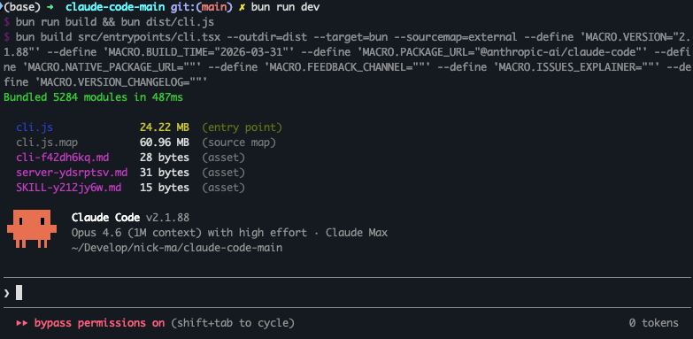
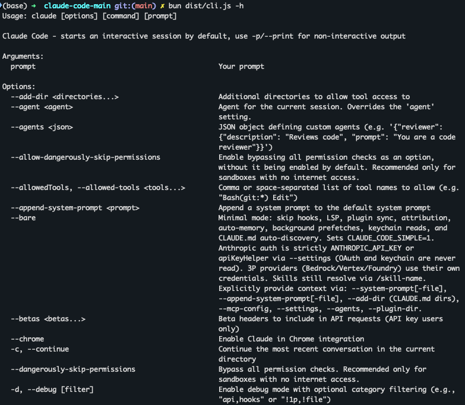

# Opened Claude Code

A buildable reconstruction of Anthropic's **Claude Code** CLI, based on the TypeScript source snapshot that was [publicly exposed](https://x.com/Fried_rice/status/2038894956459290963) on March 31, 2026 via a source map in the npm package.

The original snapshot contained only `src/` — no `package.json`, no build config, no dependencies. This repository reconstructs the full development environment so the code can be built, run, and studied.

## ScreenShots




## Quick Start

```bash
bun install
bun run build
bun dist/cli.js --help
```

**Requirements:** [Bun](https://bun.sh) v1.1+

## What Was Done

The original source extraction was missing ~150 internal files, all build configuration, and references to ~15 proprietary Anthropic packages. This repo adds:

- **`package.json`** — 80+ npm dependencies, build scripts, correct React 19 + reconciler versions
- **`tsconfig.json`** — Bun + TypeScript + JSX config
- **`shims/`** — Type declarations for `bun:bundle` feature flags, `MACRO.*` build-time constants, and proprietary packages
- **`stubs/`** — Local package stubs for `@ant/*`, `@anthropic-ai/*` internal packages and native modules
- **~150 generated source stubs** — Minimal exports for files missing from the extraction
- **`scripts/`** — `generate-stubs.ts` and `fix-stub-exports.ts` for maintaining stubs

## Usage

```bash
# Build (bundles 5284 modules in ~400ms → 24 MB output)
bun run build

# Run
bun run start                          # Interactive REPL
bun dist/cli.js -p "your prompt"       # Non-interactive mode
bun run dev                            # Build + run

# Auth (pick one)
export ANTHROPIC_API_KEY="sk-ant-..."  # API key
bun dist/cli.js login                  # OAuth via browser

# Enable feature flags at runtime
FEATURES=BRIDGE_MODE,VOICE_MODE bun dist/cli.js

# TypeScript check (~2500 residual errors from stub types)
bun run typecheck
```

## Architecture

| | |
|---|---|
| **Runtime** | Bun |
| **Language** | TypeScript (strict) |
| **Terminal UI** | React 19 + Ink (custom reconciler in `src/ink/`) |
| **CLI** | Commander.js |
| **Schema** | Zod v4 |
| **Protocols** | MCP SDK, LSP |
| **API** | Anthropic SDK |
| **Telemetry** | OpenTelemetry |
| **Auth** | OAuth 2.0, JWT, macOS Keychain |

### Entry Points

| File | Role |
|---|---|
| `src/entrypoints/cli.tsx` | Bootstrap. Fast-paths for `--version`, MCP servers, bridge, daemon. Falls through to `main.tsx`. |
| `src/main.tsx` | Full CLI setup. Parallel prefetches (MDM, keychain, GrowthBook) before heavy imports. |
| `src/QueryEngine.ts` | LLM streaming engine. Tool-call loops, thinking mode, retries, token counting. |
| `src/tools.ts` | Tool registry. Conditional imports gated on ~90 feature flags. |
| `src/commands.ts` | Slash command registry (~50 commands). |
| `src/bootstrap/state.ts` | Centralized session state store. |

### Subsystems

| Directory | Purpose |
|---|---|
| `src/tools/` | ~40 tools, each with input schema, permission model, execution logic |
| `src/commands/` | Slash commands (`/commit`, `/review`, `/compact`, `/mcp`, `/doctor`, ...) |
| `src/services/` | API client, MCP, OAuth, LSP, analytics, compaction, policy limits |
| `src/hooks/` | React hooks + permission system (`toolPermission/`) |
| `src/components/` | ~140 Ink terminal UI components |
| `src/bridge/` | Bidirectional IDE communication (VS Code, JetBrains) via JWT |
| `src/coordinator/` | Multi-agent orchestration |
| `src/skills/` | Reusable workflow system |
| `src/entrypoints/sdk/` | SDK type schemas — `coreSchemas.ts` and `controlSchemas.ts` are the source of truth |

### Design Patterns

- **Build-time macros** — `MACRO.VERSION`, `MACRO.BUILD_TIME`, etc. inlined via `bun build --define`
- **Feature flags** — `feature()` from `bun:bundle` (~90 flags). Dead-code elimination at build time. In dev, all default to `false`.
- **Ant-only gating** — `process.env.USER_TYPE === 'ant'` for internal Anthropic tools
- **Lazy requires** — `const getFoo = () => require(...)` to break circular dependencies
- **Parallel prefetch** — MDM, keychain, API preconnect fire before heavy module evaluation

## Known Limitations

- **~150 stub files** export `any` — runtime errors will occur if those code paths are hit
- **TypeScript strict mode relaxed** — `noImplicitAny: false`, `strictNullChecks: false` due to stub types
- **Proprietary packages** (`@ant/*`, `@anthropic-ai/sandbox-runtime`, etc.) — replaced with minimal stubs
- **Native modules** (`color-diff-napi`, `modifiers-napi`, `audio-capture-napi`) — stubbed out; structured diffs, modifier keys, and voice input won't work
- **No tests** — the original snapshot contained no test files or test runner config

## Origin

On March 31, 2026, [Chaofan Shou](https://x.com/Fried_rice) noted that Claude Code's TypeScript source was reachable via a `.map` file in the npm package. The source map referenced unobfuscated sources on Anthropic's R2 bucket. This repo mirrors that `src/` snapshot with a reconstructed build environment.

## Disclaimer

- The original source is the property of **Anthropic**.
- This repository is **not affiliated with, endorsed by, or maintained by Anthropic**.
- This project is provided **strictly for educational, research, and non-commercial purposes only**. Any commercial use is **explicitly prohibited**.
- The uploader assumes **no responsibility or liability** for any consequences arising from the use of this project. Use at your own risk.
- By using this repository, you agree that you will only use it for learning, academic research, and technical study.
