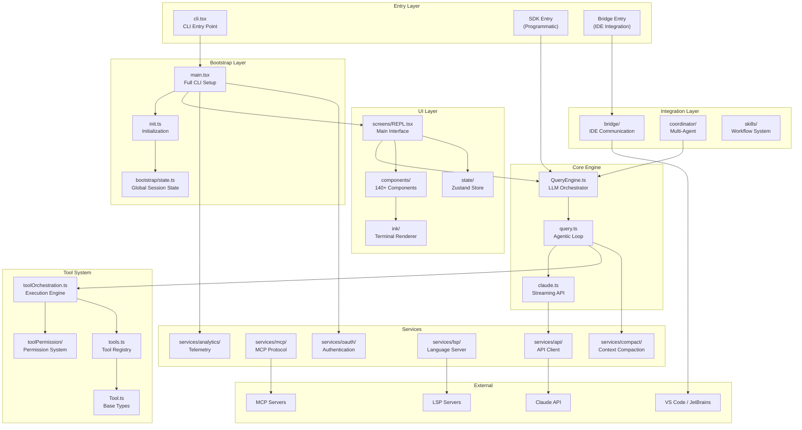
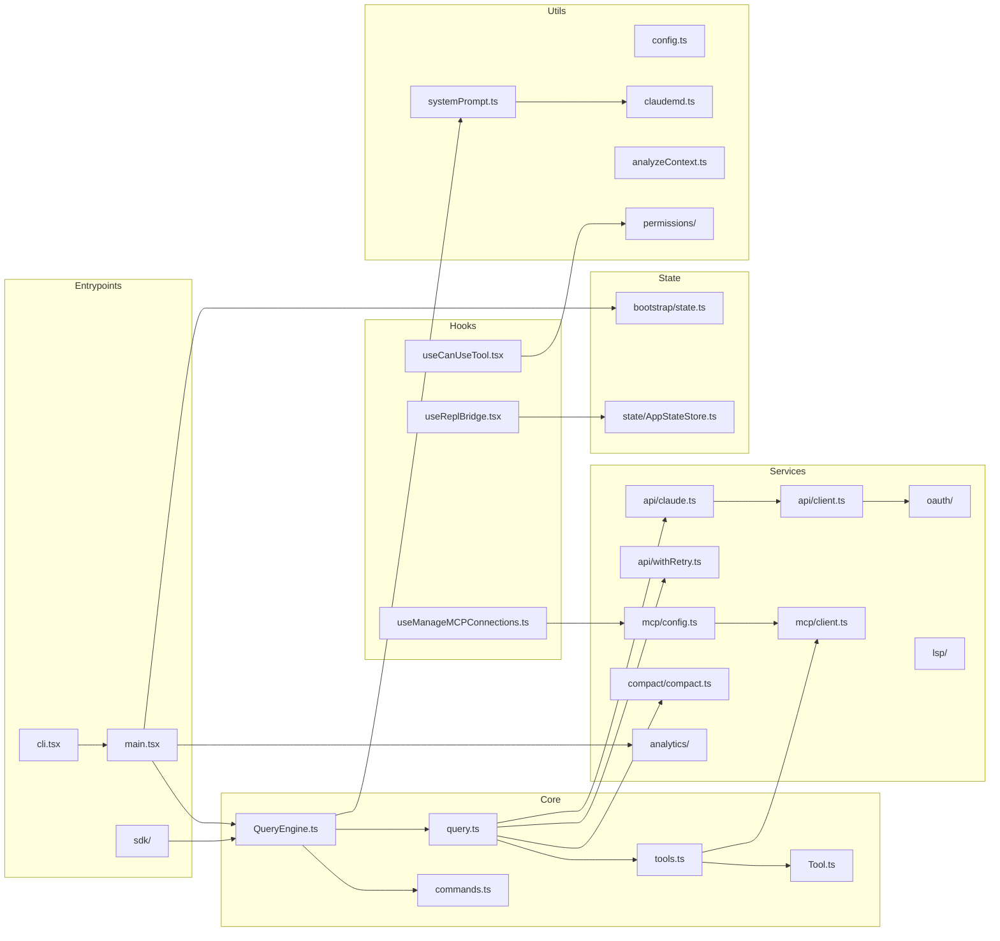
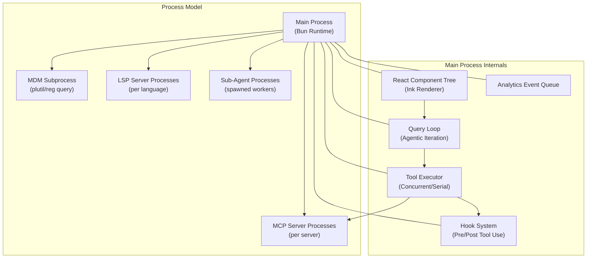

# System Architecture Overview

> Reverse-engineered from Claude Code CLI source snapshot (2026-03-31)

## High-Level Architecture

Claude Code is a terminal-based AI coding assistant built with **Bun + TypeScript**, **React 19 + Ink** for terminal UI, and **Commander.js** for CLI parsing. It operates as an agentic loop — accepting user input, querying the Claude API, executing tools, and iterating until the task is complete.

## Module Dependency Graph

## Subsystem Overview

| Subsystem | Location | Purpose | Key Files |
|-----------|----------|---------|-----------|
| **Entry Points** | `src/entrypoints/` | CLI bootstrap, fast-paths, mode dispatch | `cli.tsx`, `sdk/` |
| **Core Engine** | `src/` | Query orchestration, tool loop | `QueryEngine.ts`, `query.ts` |
| **Tool System** | `src/tools/`, `src/Tool.ts` | 55+ tools with schema, permissions, execution | `tools.ts`, `Tool.ts` |
| **Command System** | `src/commands/` | 60+ slash commands | `commands.ts` |
| **Permission System** | `src/hooks/toolPermission/` | Multi-mode permission checking | `useCanUseTool.tsx` |
| **API Client** | `src/services/api/` | Multi-provider Claude API access | `client.ts`, `claude.ts` |
| **MCP** | `src/services/mcp/` | Model Context Protocol integration | `client.ts`, `config.ts` |
| **OAuth** | `src/services/oauth/` | Authentication flows | `index.ts`, `client.ts` |
| **LSP** | `src/services/lsp/` | Language server integration | `LSPServerManager.ts` |
| **Compaction** | `src/services/compact/` | Context window management | `compact.ts`, `autoCompact.ts` |
| **Analytics** | `src/services/analytics/` | Telemetry and event tracking | `index.ts`, `growthbook.ts` |
| **UI** | `src/components/`, `src/ink/` | Terminal UI via React + Ink | `REPL.tsx`, `App.tsx` |
| **Bridge** | `src/bridge/` | IDE communication (VS Code, JetBrains) | `bridgeApi.ts`, `bridgeMessaging.ts` |
| **Coordinator** | `src/coordinator/` | Multi-agent orchestration | `coordinatorMode.ts` |
| **Skills** | `src/skills/` | Reusable workflow system | `bundledSkills.ts` |
| **Configuration** | `src/utils/settings/` | Multi-source settings hierarchy | `settings.ts`, `types.ts` |
| **Bootstrap** | `src/bootstrap/` | Session state and initialization | `state.ts` |
| **Utilities** | `src/utils/` | 340+ utility modules | Various |
| **Constants** | `src/constants/` | System prompts, limits, product info | `prompts.ts`, `betas.ts` |

## Runtime Architecture

## Technology Stack

| Layer | Technology | Version |
|-------|-----------|---------|
| Runtime | Bun | Latest |
| Language | TypeScript | Strict (relaxed for stubs) |
| UI Framework | React | 19 |
| Terminal Rendering | Ink (custom fork) | Custom |
| Layout Engine | Yoga | Native |
| CLI Parsing | Commander.js | Extra typings |
| Schema Validation | Zod | v4 |
| State Management | Zustand | Latest |
| Build System | Bun bundler | Built-in |
| Protocol | MCP SDK | @modelcontextprotocol/sdk |
| Protocol | LSP | Custom client |

## Design Philosophy

1. **Fast-Path Optimization**: Zero-import paths for `--version`, `--help` return instantly without loading the 200+ module dependency tree.

2. **Parallel Prefetch**: MDM settings, keychain reads, and API preconnect fire at module load time, completing during the ~135ms import evaluation.

3. **Build-Time DCE**: Feature flags via `bun:bundle` enable dead-code elimination — entire subsystems (Bridge, Daemon, Voice) are compiled out of non-Anthropic builds.

4. **Lazy Requires**: Circular dependency breaks use `const getFoo = () => require(...)` pattern extensively.

5. **Safety by Default**: Every tool invocation passes through a multi-layer permission system with rules, hooks, classifiers, and user consent.

6. **Extensibility**: MCP servers, plugins, skills, hooks, and custom agents provide multiple extension points without modifying core code.
