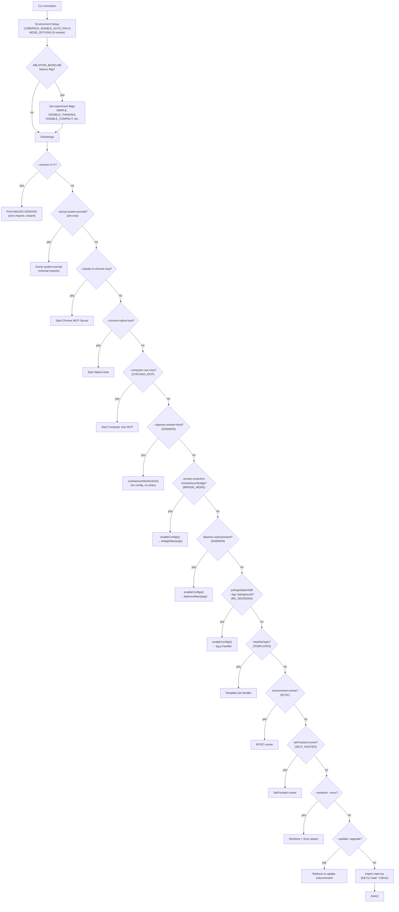
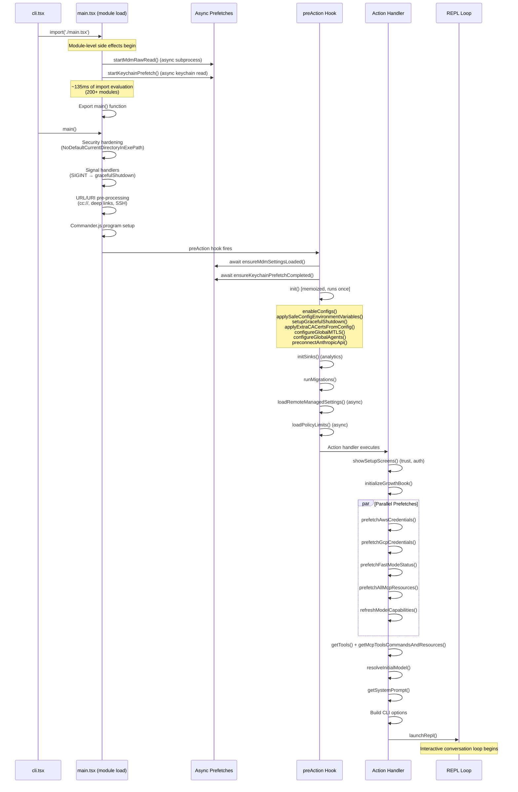
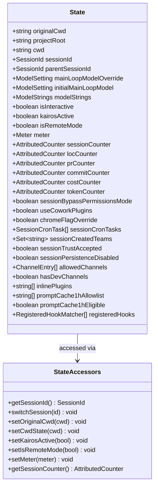
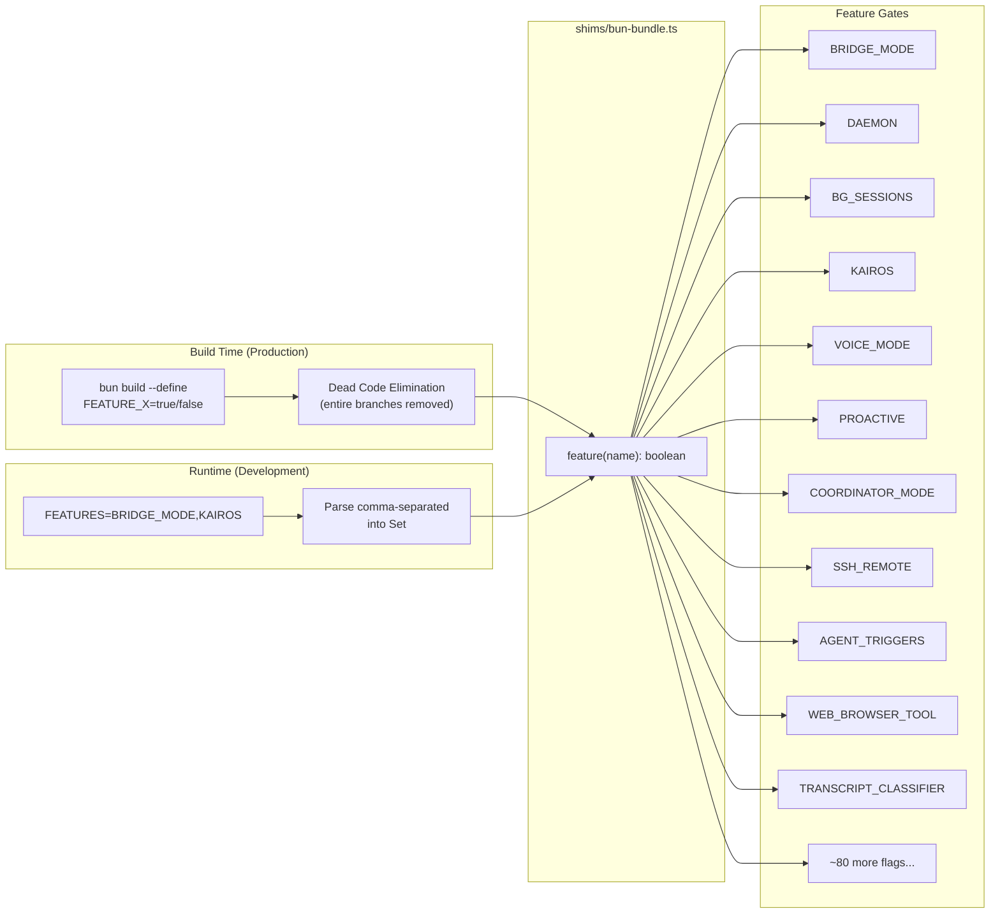
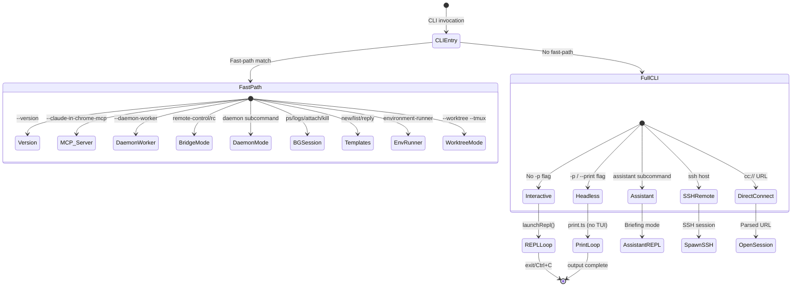
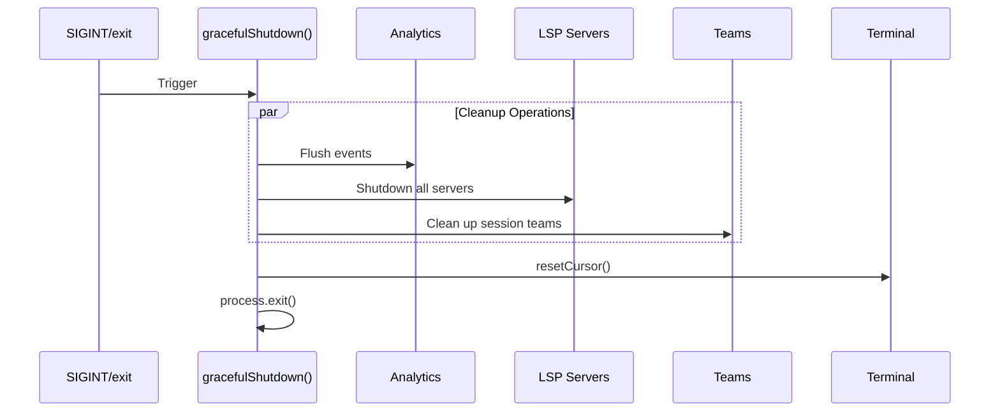

# Startup and Bootstrap

## Entry Point Decision Tree

The CLI entry point (`src/entrypoints/cli.tsx`) implements a fast-path routing system that avoids loading the full application for simple operations.

## Full Initialization Sequence

When the fast-path check falls through, the full CLI loads via `main.tsx`:

## Bootstrap State

The global session state (`src/bootstrap/state.ts`) is a mutable singleton that holds all session-scoped configuration:

## Feature Flag System

Feature flags control conditional compilation and runtime behavior:

## Operational Modes

## Environment Variables

| Variable | Phase | Effect |
|----------|-------|--------|
| `CLAUDE_CODE_REMOTE` | Module load | Increase max heap to 8GB |
| `CLAUDE_CODE_ABLATION_BASELINE` | Module load | Set experiment flags |
| `COREPACK_ENABLE_AUTO_PIN` | Module load | Prevent yarn auto-pinning |
| `CLAUDE_CODE_SIMPLE` | Runtime | Minimal mode (skip hooks, LSP, plugins) |
| `CLAUDE_CODE_PROFILE_STARTUP` | Runtime | Enable startup profiling |
| `FEATURES` | Module load | Enable feature flags (dev mode) |
| `USER_TYPE` | Runtime | `ant` enables internal features |
| `CLAUDE_CODE_DISABLE_TERMINAL_TITLE` | Runtime | Skip process title |
| `API_TIMEOUT_MS` | Runtime | API request timeout |
| `CLAUDE_CODE_MAX_CONTEXT_TOKENS` | Runtime | Override context window size |
| `CLAUDE_CODE_EXTRA_BODY` | Runtime | Extra API request body params |
| `ANTHROPIC_API_KEY` | Runtime | Direct API authentication |
| `ANTHROPIC_CUSTOM_HEADERS` | Runtime | Custom API headers |

## Graceful Shutdown

## Startup Performance Profiling

The startup profiler tracks 40+ checkpoints with production sampling:

```mermaid
gantt
    title Startup Timeline (Approximate)
    dateFormat X
    axisFormat %L ms

    section cli.tsx
    Environment setup     : 0, 5
    Fast-path checks      : 5, 15
    Import main.tsx       : 15, 20

    section main.tsx (module)
    Start MDM read (async)     : 20, 25
    Start keychain (async)     : 20, 25
    Heavy imports (~135ms)     : 25, 160

    section preAction
    Await MDM + keychain       : 160, 170
    init() - configs           : 170, 185
    init() - network setup     : 185, 200
    init() - API preconnect    : 200, 210
    initSinks()                : 210, 215
    Migrations                 : 215, 220

    section Action Handler
    Setup screens              : 220, 260
    GrowthBook init            : 260, 270
    Parallel prefetches        : 270, 310
    Load tools + MCP           : 310, 350
    System prompt build        : 350, 370
    Launch REPL                : 370, 380
```

