# Query Engine and API Client

## QueryEngine Overview

The `QueryEngine` (`src/QueryEngine.ts`) is the central orchestrator for conversations with Claude. One instance exists per conversation session, owning message state, usage tracking, and the agentic tool-call loop.

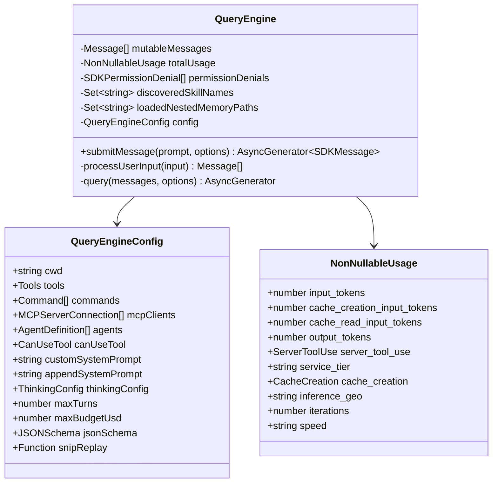

## Message Flow

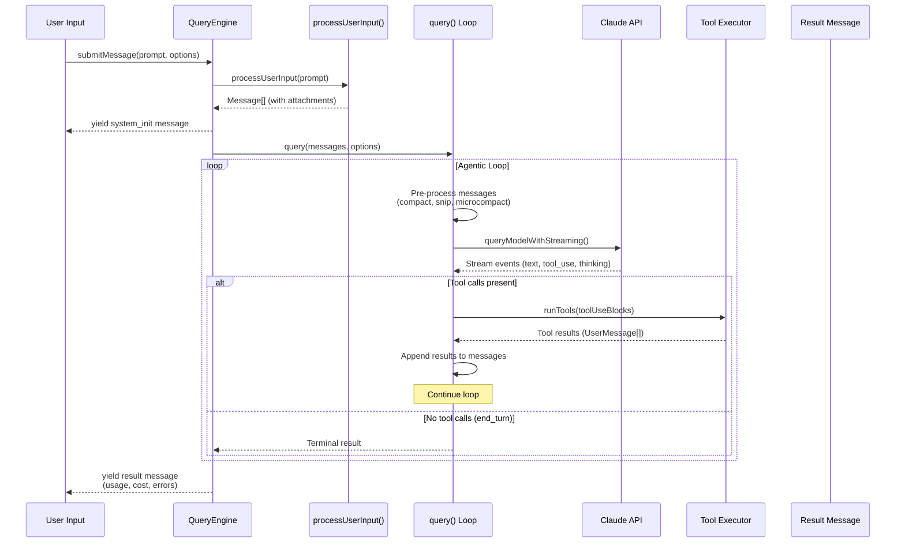

## API Client Architecture

The API client (`src/services/api/client.ts`) supports multiple authentication providers:

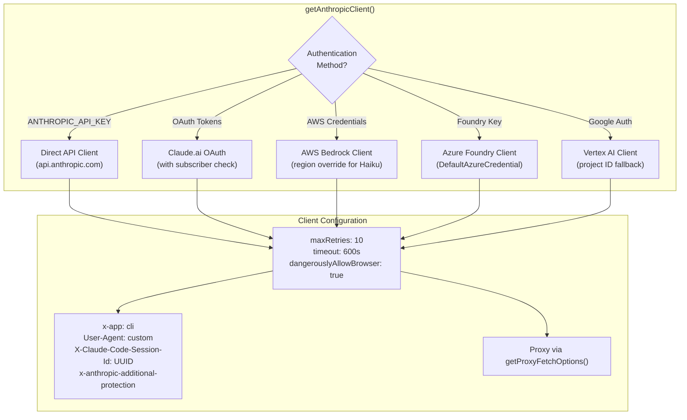

## Streaming Implementation

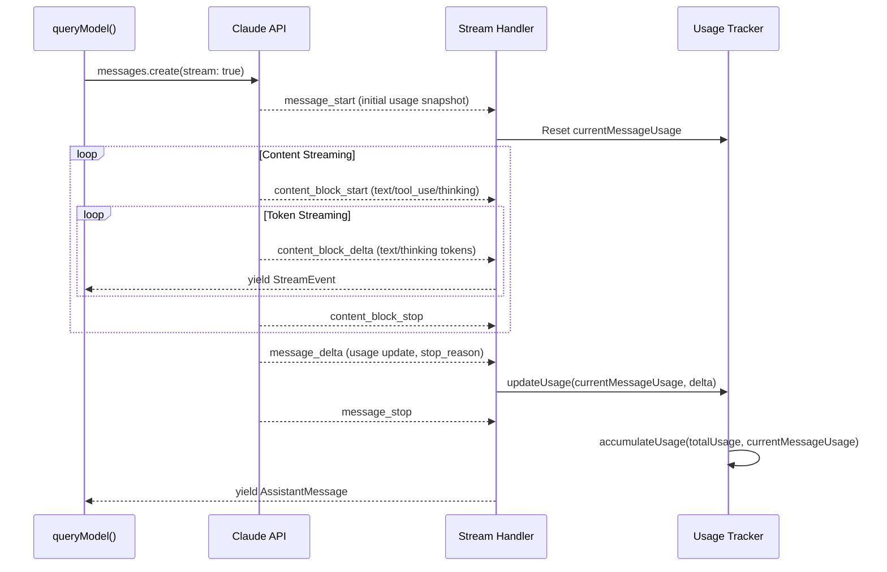

## Tool Call Loop State Machine

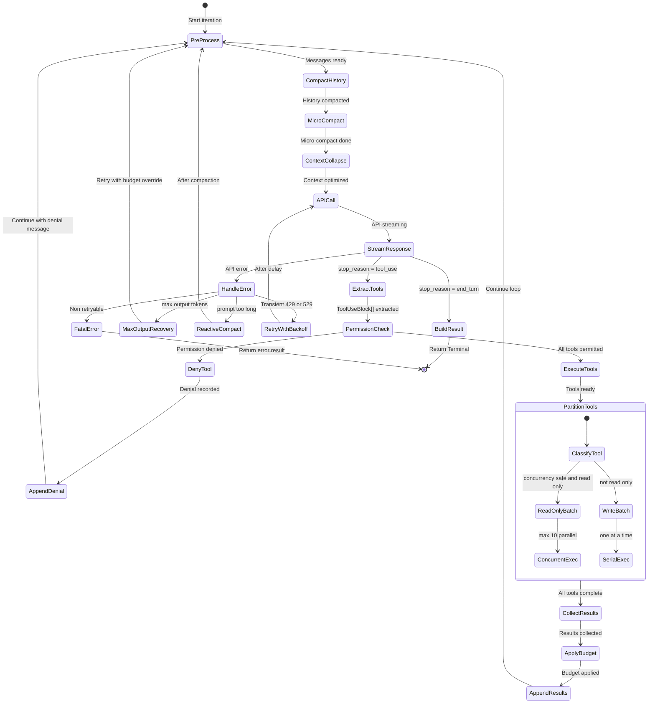

## Retry Logic

The retry system (`src/services/api/withRetry.ts`) handles transient failures with provider-specific strategies:

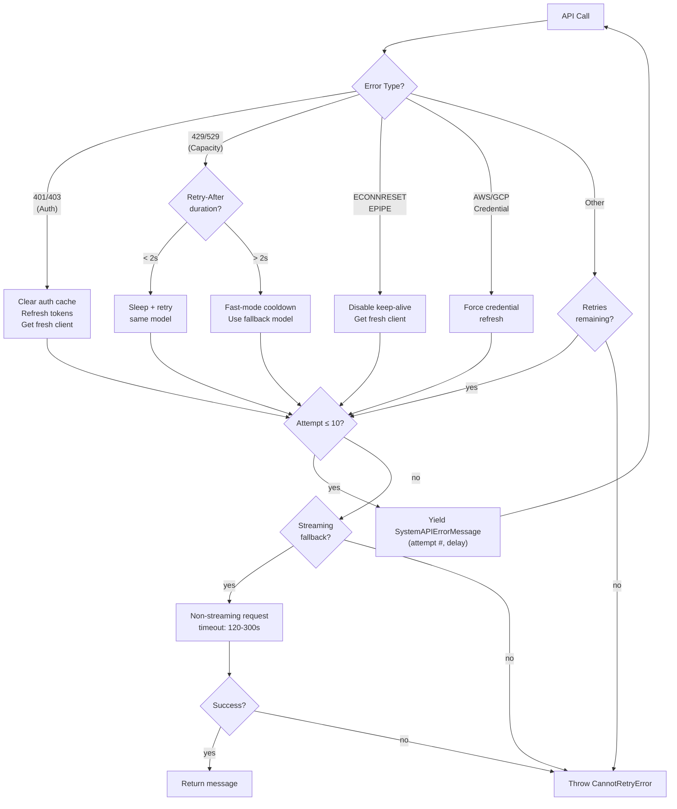

### Retry by Query Source

| Query Source | Retries 529? | Background? | Notes |
|-------------|-------------|-------------|-------|
| `repl_main_thread*` | Yes | No | User-blocking, full retry |
| `sdk` | Yes | No | Programmatic, full retry |
| `agent:*` | Yes | No | Sub-agent work |
| `verification_agent` | Yes | No | Critical verification |
| `auto_mode` | Yes | No | Security classifier |
| `summaries` | No | Yes | Non-critical background |
| `titles` | No | Yes | Non-critical background |
| `extract_memories` | No | Yes | Non-critical background |

## API Request Construction

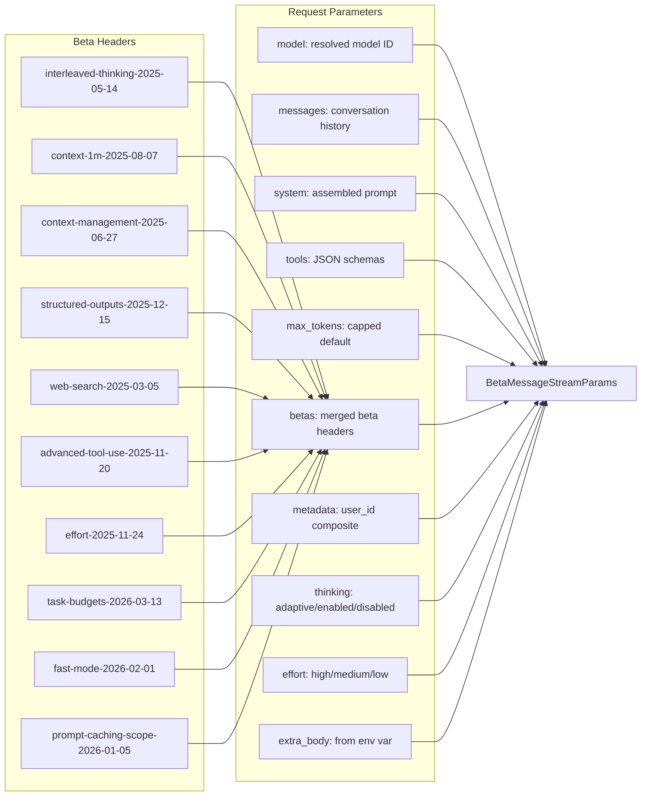

## Thinking Mode Configuration

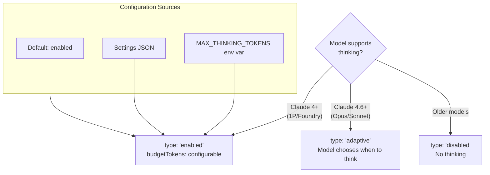

## Token Counting and Cost Tracking

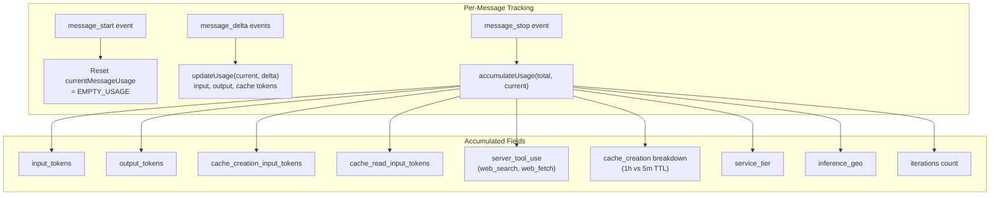

## Message Types

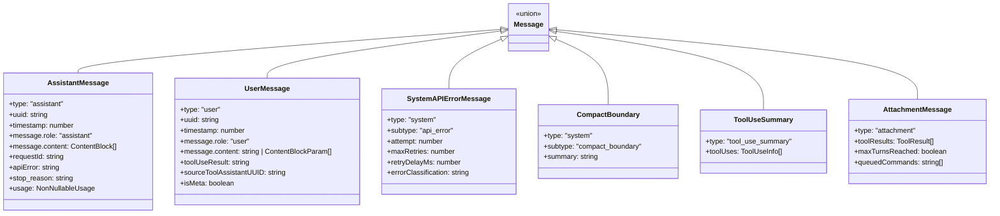

## Context Compaction

When the conversation approaches the context window limit, automatic compaction kicks in:

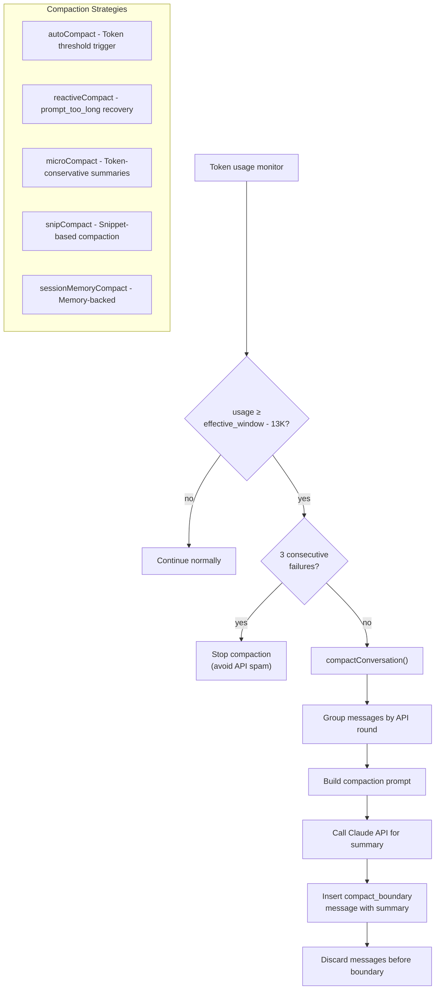
