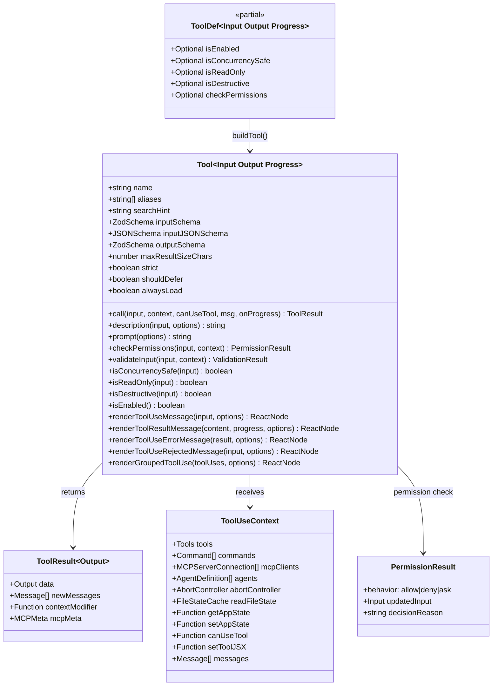
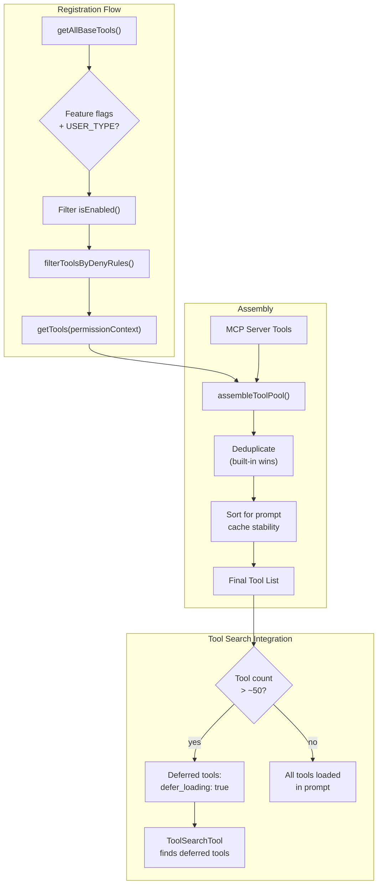
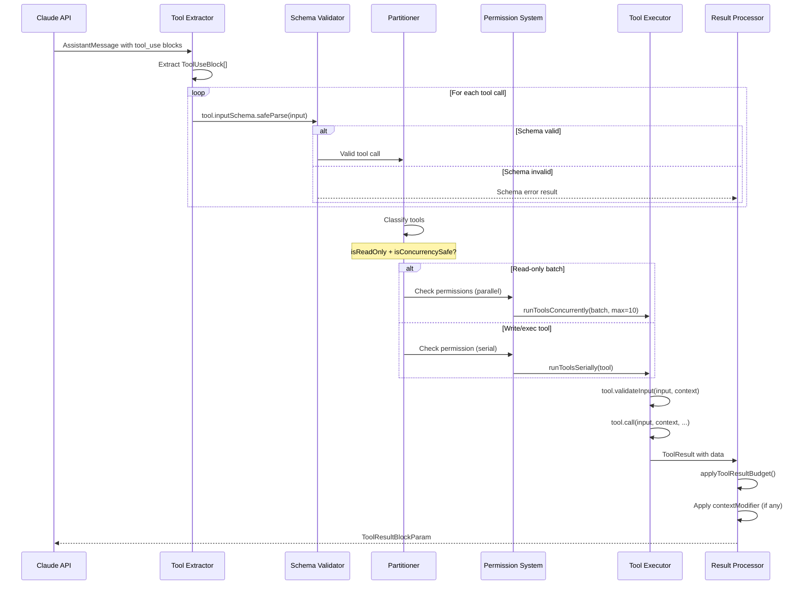
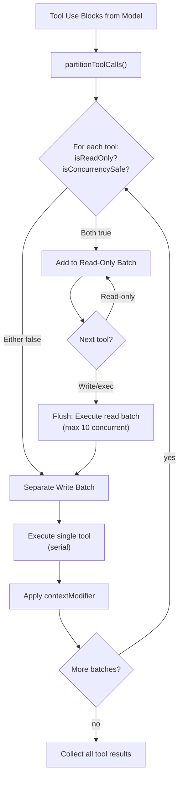
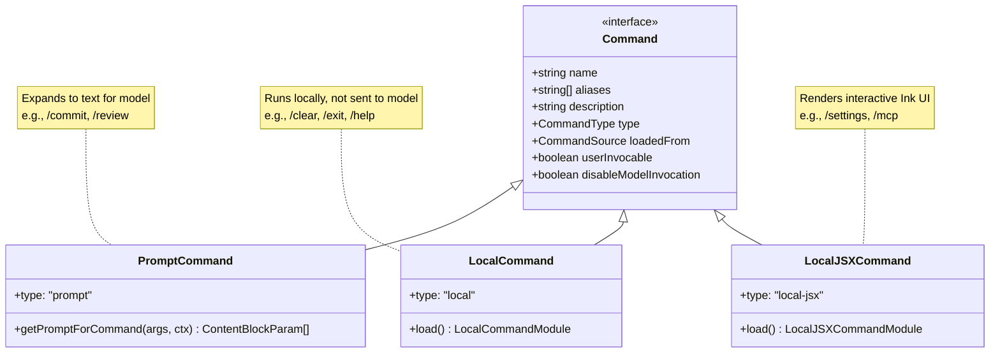
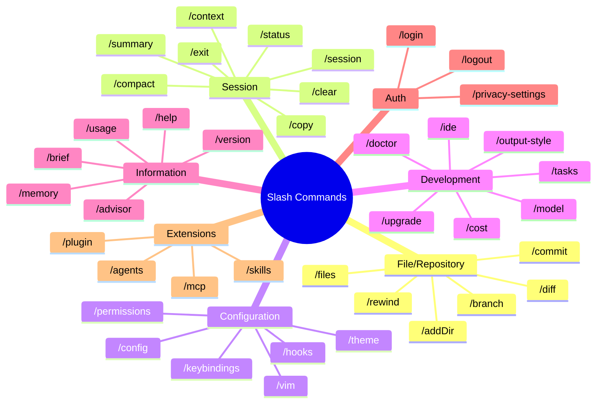
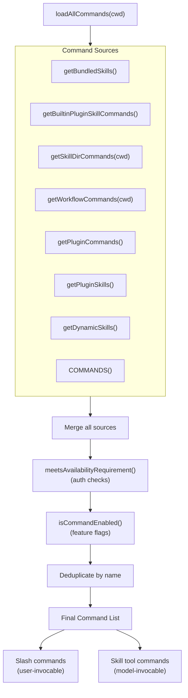
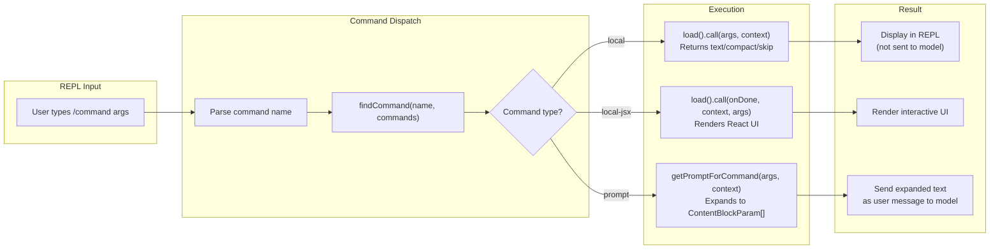

# Tools and Commands

## Tool Type System

Every tool in Claude Code implements the `Tool` interface defined in `src/Tool.ts`:

## Tool Registry

Tools are registered via `src/tools.ts` with conditional loading based on feature flags, environment, and user type:

## Complete Tool Inventory

### Core Tools (Always Available)

| Tool | Read-Only | Concurrent | Description |
|------|-----------|-----------|-------------|
| **BashTool** | No | No | Execute shell commands |
| **FileReadTool** | Yes | Yes | Read files (images, PDFs, notebooks) |
| **FileEditTool** | No | No | Diff-based file editing |
| **FileWriteTool** | No | No | Create/overwrite files |
| **GlobTool** | Yes | Yes | File pattern matching |
| **GrepTool** | Yes | Yes | Content search (ripgrep) |
| **AgentTool** | No | No | Spawn sub-agents |
| **WebFetchTool** | Yes | Yes | Fetch web pages |
| **WebSearchTool** | Yes | Yes | Web search (Bing) |
| **NotebookEditTool** | No | No | Jupyter cell editing |
| **SkillTool** | No | No | Invoke skills/workflows |
| **AskUserQuestionTool** | No | No | Prompt user for input |
| **ToolSearchTool** | Yes | Yes | Discover deferred tools |

### Task Management Tools

| Tool | Description |
|------|-------------|
| **TaskCreateTool** | Create tasks |
| **TaskGetTool** | Retrieve task details |
| **TaskUpdateTool** | Update task status |
| **TaskListTool** | List all tasks |
| **TaskStopTool** | Stop running tasks |
| **TaskOutputTool** | Get task output |
| **TodoWriteTool** | Update todo panel |

### Mode Tools

| Tool | Description |
|------|-------------|
| **EnterPlanModeTool** | Enter plan mode |
| **ExitPlanModeV2Tool** | Exit plan mode |
| **EnterWorktreeTool** | Create git worktree |
| **ExitWorktreeTool** | Exit worktree |

### MCP Integration Tools

| Tool | Description |
|------|-------------|
| **MCPTool** | Call MCP server tools |
| **ListMcpResourcesTool** | List MCP resources |
| **ReadMcpResourceTool** | Read MCP resources |
| **McpAuthTool** | Handle MCP auth |

### Feature-Gated Tools

| Tool | Feature Gate | Description |
|------|-------------|-------------|
| **SendMessageTool** | (lazy) | Message other agents |
| **CronCreateTool** | AGENT_TRIGGERS | Create scheduled tasks |
| **CronDeleteTool** | AGENT_TRIGGERS | Delete scheduled tasks |
| **CronListTool** | AGENT_TRIGGERS | List scheduled tasks |
| **RemoteTriggerTool** | AGENT_TRIGGERS_REMOTE | Remote execution |
| **SleepTool** | PROACTIVE/KAIROS | Wait/sleep |
| **WebBrowserTool** | WEB_BROWSER_TOOL | Browser automation |
| **LSPTool** | (plugins) | Language server protocol |
| **PowerShellTool** | (enabled) | PowerShell execution |
| **WorkflowTool** | WORKFLOW_SCRIPTS | Workflow execution |
| **SnipTool** | HISTORY_SNIP | History snipping |
| **MonitorTool** | MONITOR_TOOL | Resource monitoring |

### Internal/Ant-Only Tools

| Tool | Description |
|------|-------------|
| **REPLTool** | REPL/VM execution |
| **ConfigTool** | Modify settings.json |
| **TeamCreateTool** | Create agent teams |
| **TeamDeleteTool** | Delete agent teams |
| **TungstenTool** | Internal integration |
| **SuggestBackgroundPRTool** | Background PR suggestions |

## Tool Execution Lifecycle

## Tool Concurrency Model

## Slash Command System

Commands are registered in `src/commands.ts` and come in three types:

### Command Categories

### Command Discovery Flow

### Command-Tool Interaction

