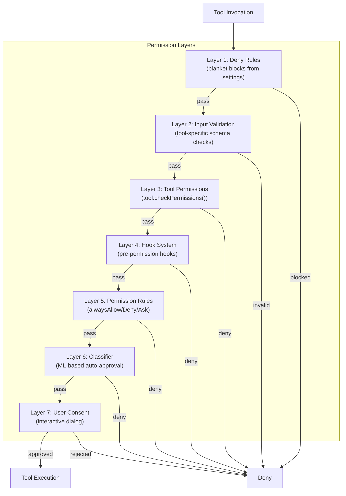
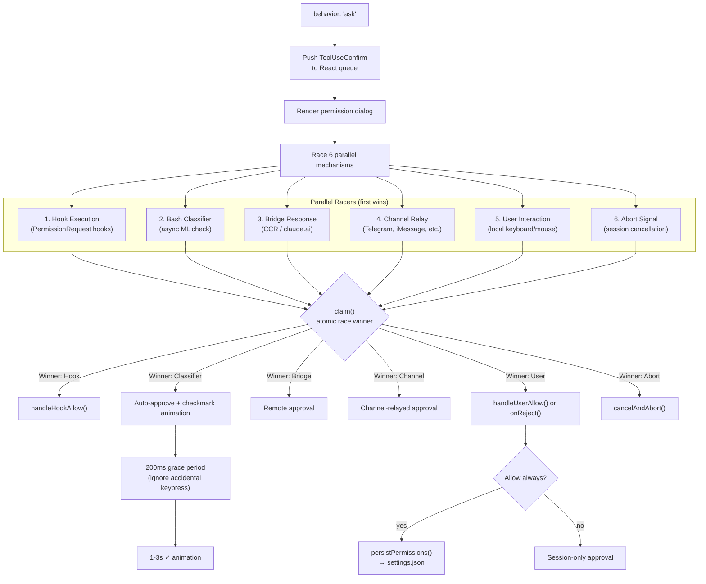
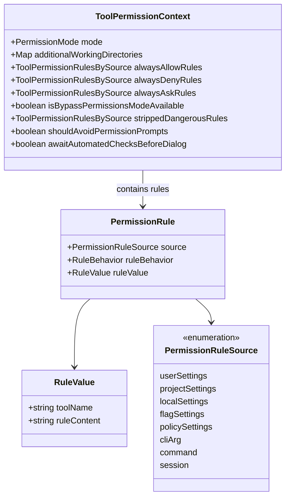
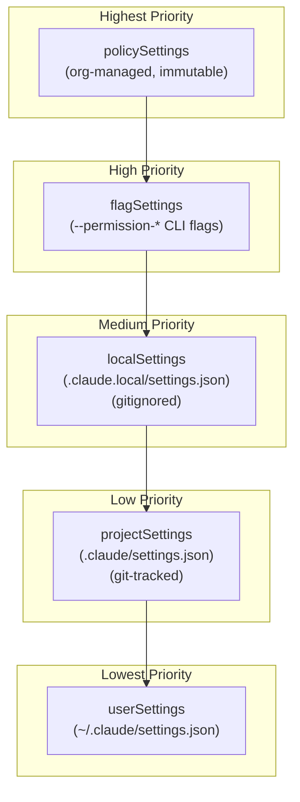
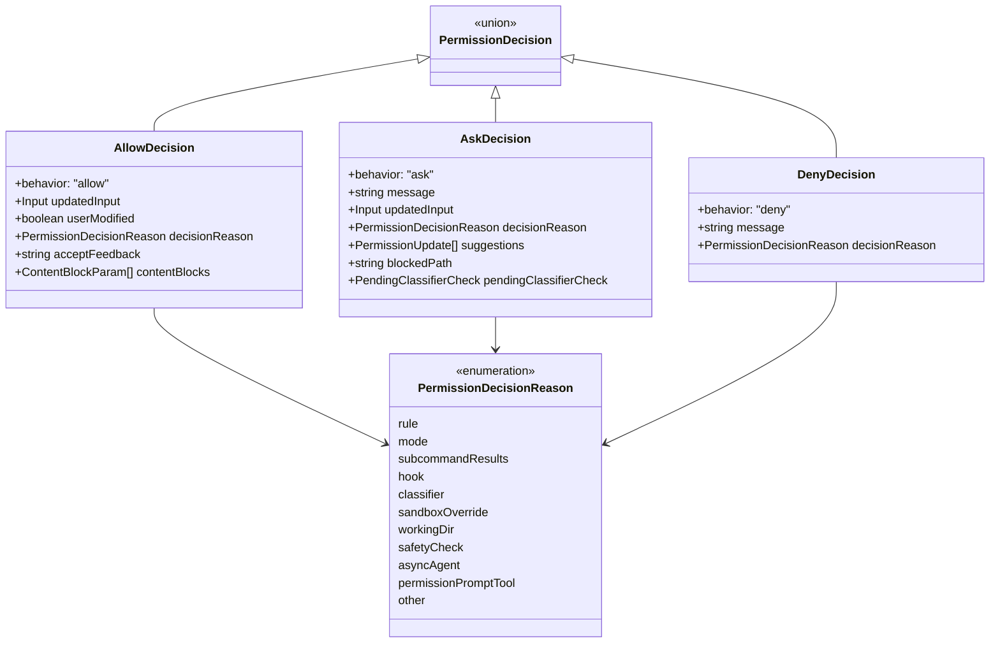
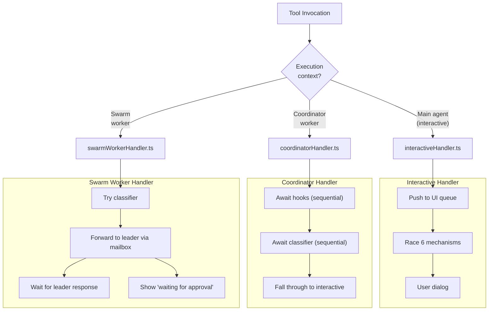
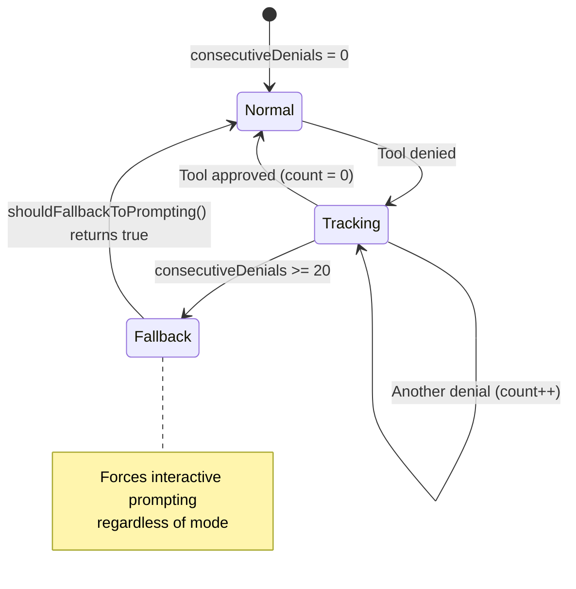
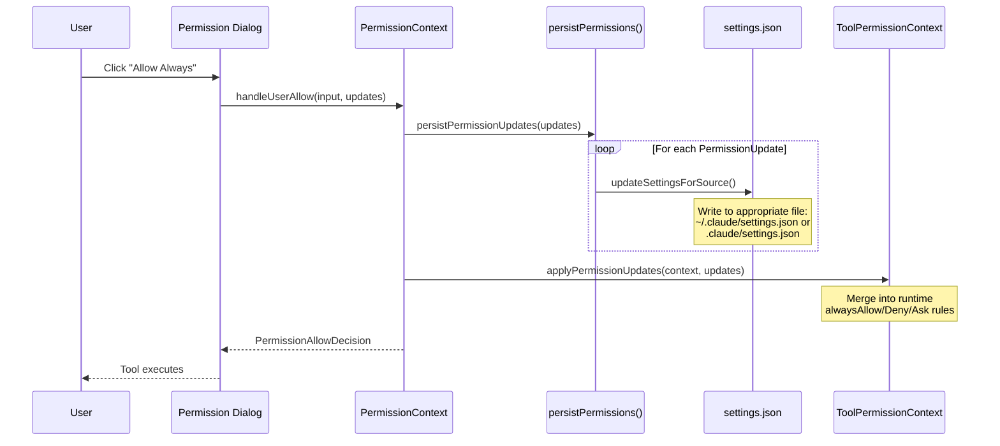

# Permission System

## Architecture Overview

The permission system (`src/hooks/toolPermission/`) is the security backbone of Claude Code. Every tool invocation passes through multi-layered permission checks before execution.



## Permission Modes

```mermaid
stateDiagram-v2
    [*] --> Default : Normal startup
    [*] --> Auto : TRANSCRIPT_CLASSIFIER enabled
    [*] --> BypassPermissions : bypass permissions flag

    Default --> Plan : /plan command
    Plan --> Default : ExitPlanMode

    Default --> AcceptEdits : User switches mode
    Default --> DontAsk : User switches mode
    AcceptEdits --> Default : User switches back
    DontAsk --> Default : User switches back

    state Default {
        [*] --> D_CheckRules
        D_CheckRules --> D_Allow : alwaysAllow match
        D_CheckRules --> D_Deny : alwaysDeny match
        D_CheckRules --> D_AskUser : No matching rule
        D_AskUser --> D_Allow : User approves
        D_AskUser --> D_Deny : User rejects
    }

    state Auto {
        [*] --> A_ClassifierCheck
        A_ClassifierCheck --> A_Allow : Classified safe
        A_ClassifierCheck --> A_AskUser : Uncertain
        A_AskUser --> A_Allow : User approves
        A_AskUser --> A_Deny : User rejects
    }

    state BypassPermissions {
        [*] --> BP_AllowAll : All tools auto approved
    }

    state Plan {
        [*] --> P_ReadOnly : Read only tools only
    }

    state AcceptEdits {
        [*] --> AE_AutoEdits : File edits auto approved
        AE_AutoEdits --> AE_AskOther : Non edit tools prompt
    }

    state DontAsk {
        [*] --> DA_DenyUnknown : Deny unless explicitly allowed
    }
```

| Mode | Behavior | Risk Level |
|------|----------|-----------|
| `default` | Ask user when no rule matches | Low |
| `plan` | Read-only tools only, explicit approval | Lowest |
| `acceptEdits` | Auto-allow file edits, ask for others | Medium |
| `bypassPermissions` | Allow everything | Highest |
| `dontAsk` | Deny unless explicitly allowed | Low |
| `auto` | ML classifier decides (ant-only) | Medium |

## Permission Decision Flow

```mermaid
flowchart TD
    Start["canUseTool(tool, input, context)"] --> DenyRules{"Step 1:<br/>Deny rules match?"}

    DenyRules -->|yes| Denied["Return DENY<br/>(blanket block)"]
    DenyRules -->|no| Validate{"Step 2:<br/>validateInput()?"}

    Validate -->|invalid| Denied
    Validate -->|valid| ToolCheck{"Step 3:<br/>tool.checkPermissions()"}

    ToolCheck -->|deny| Denied
    ToolCheck -->|allow| Allowed["Return ALLOW"]
    ToolCheck -->|ask| Hooks{"Step 4:<br/>Permission hooks?"}

    Hooks -->|hook resolves| HookDecision{"Hook decision?"}
    HookDecision -->|allow| Allowed
    HookDecision -->|deny| Denied
    Hooks -->|no hook| Rules{"Step 5:<br/>Permission rules match?"}

    Rules -->|alwaysAllow| Allowed
    Rules -->|alwaysDeny| Denied
    Rules -->|alwaysAsk| AskUser
    Rules -->|no match| ModeCheck{"Step 6:<br/>Permission mode?"}

    ModeCheck -->|default| AskUser["Show interactive dialog"]
    ModeCheck -->|bypass| Allowed
    ModeCheck -->|acceptEdits| EditCheck{"Is file edit?"}
    ModeCheck -->|dontAsk| Denied
    ModeCheck -->|auto| Classifier["Step 6b:<br/>Run classifier"]

    EditCheck -->|yes| Allowed
    EditCheck -->|no| AskUser

    Classifier -->|safe| Allowed
    Classifier -->|unsafe| AskUser
    Classifier -->|uncertain| AskUser

    AskUser --> UserDecision{"User response?"}
    UserDecision -->|Allow once| Allowed
    UserDecision -->|Allow always| PersistAllow["Persist rule + ALLOW"]
    UserDecision -->|Reject| Denied
    UserDecision -->|Abort (Ctrl+C)| Denied
```

## Interactive Permission Handler

When the decision is `ask`, the interactive handler races multiple approval mechanisms:



## Permission Rules



### Rule Format

Rules follow the pattern `ToolName[(content)]`:

| Rule | Meaning |
|------|---------|
| `Bash` | All bash commands |
| `Bash(python:*)` | Bash commands starting with `python:` |
| `Bash(git *)` | Bash commands starting with `git ` |
| `Edit(/path/to/file.ts)` | Edit a specific file |
| `FileRead` | All file reads |
| `mcp__server__tool` | Specific MCP tool |

### Settings File Hierarchy (Priority Order)



## Permission Decision Types



## Three Permission Handlers

Different execution contexts use different permission handlers:



## Denial Tracking



## Permission Persistence Flow



## Analytics Events

| Event | Trigger |
|-------|---------|
| `tengu_tool_use_granted_in_config` | Auto-approved by allowlist |
| `tengu_tool_use_granted_by_classifier` | Classifier auto-approved |
| `tengu_tool_use_granted_in_prompt_permanent` | User approved "always" |
| `tengu_tool_use_granted_in_prompt_temporary` | User approved "once" |
| `tengu_tool_use_granted_by_permission_hook` | Hook auto-approved |
| `tengu_tool_use_denied_in_config` | Denied by denylist |
| `tengu_tool_use_rejected_in_prompt` | User rejected |
