# Services

## Services Directory Map

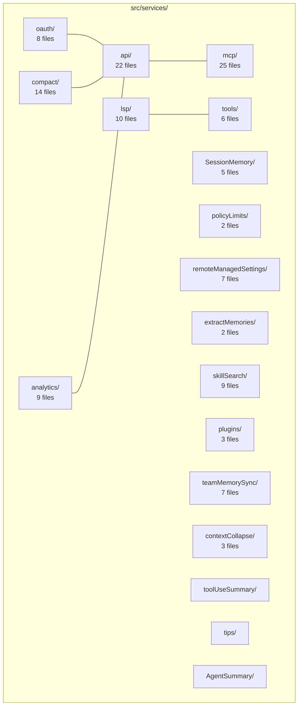

## MCP (Model Context Protocol)

MCP is the largest service subsystem (25 files, 12,238 LOC), managing integration with external tool servers.

### MCP Architecture

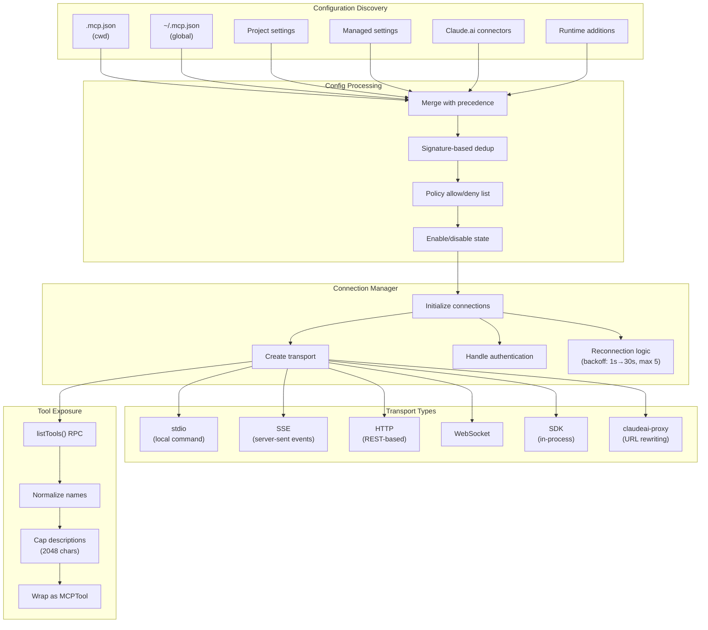

### MCP Server Configuration Schema

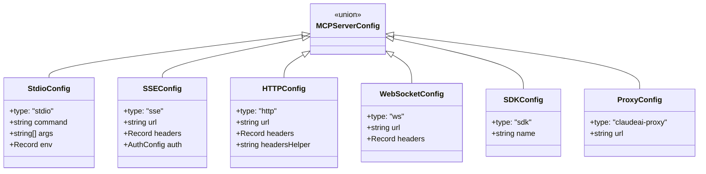

### MCP Connection Lifecycle

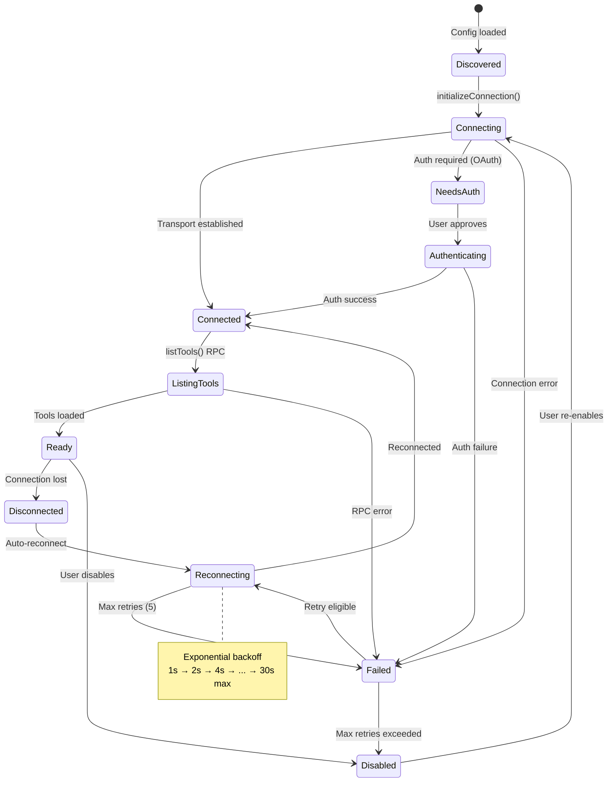

### MCP Authentication

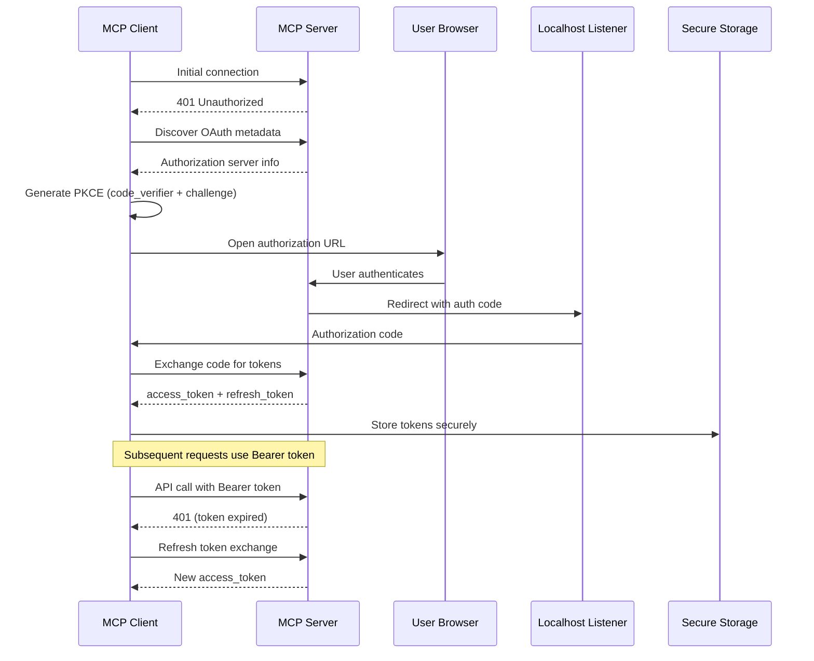

## OAuth Service

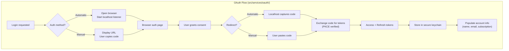

## LSP Integration

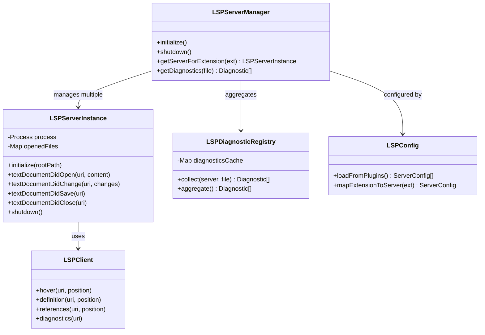

### LSP Communication

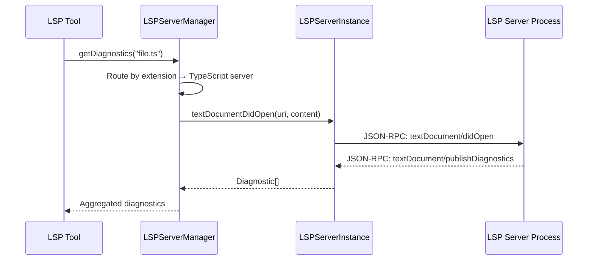

## Context Compaction

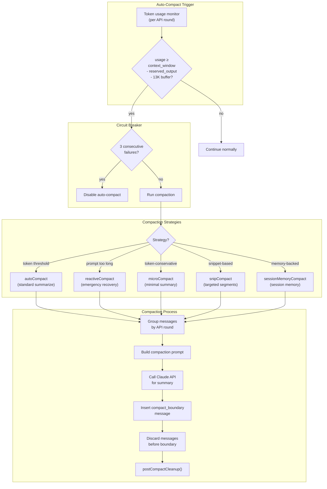

## Analytics System

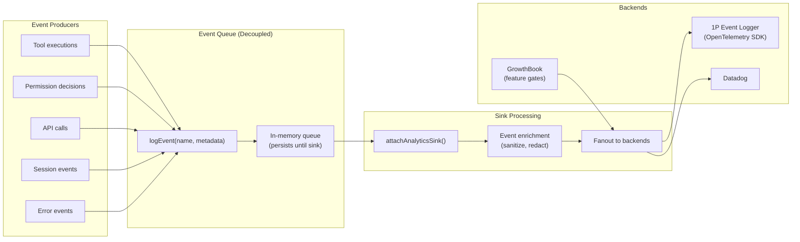

### GrowthBook Feature Gates

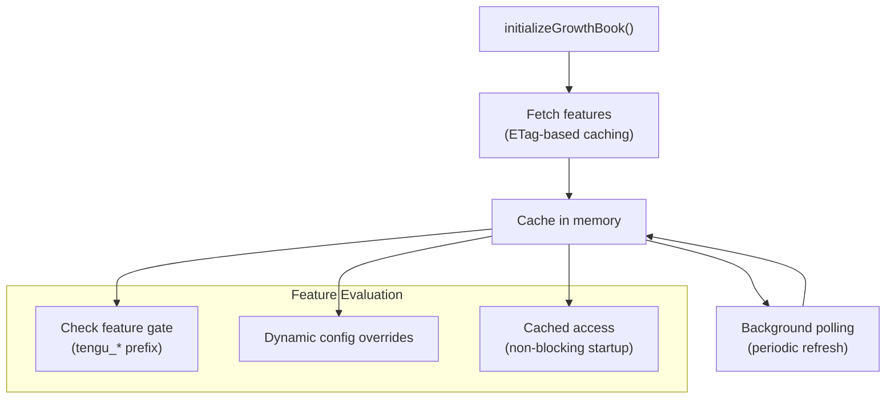

## Policy Limits

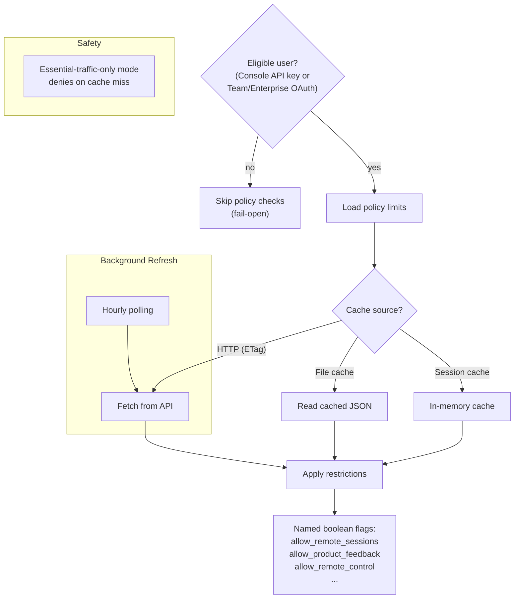

## Tool Execution Orchestration

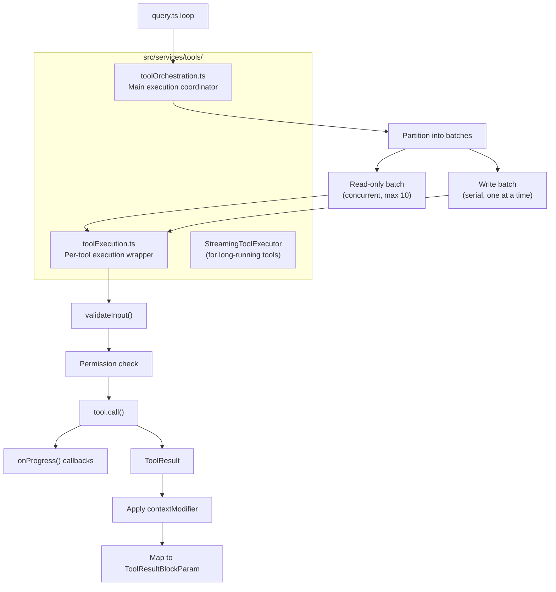

## Service Initialization Order

```mermaid
gantt
    title Service Initialization Timeline
    dateFormat X
    axisFormat %L

    section Phase 1 - Module Load
    MDM subprocess (async)          : 0, 5
    Keychain prefetch (async)       : 0, 5

    section Phase 2 - init()
    enableConfigs()                 : 5, 10
    applySafeConfigEnvVars()        : 10, 12
    applyExtraCACerts()             : 12, 14
    setupGracefulShutdown()         : 14, 16
    configureGlobalMTLS()           : 16, 18
    configureGlobalAgents()         : 18, 20
    preconnectAnthropicApi()        : 20, 25
    attachAnalyticsSink()           : 25, 27

    section Phase 3 - Action Handler
    GrowthBook init                 : 30, 35
    AWS/GCP credential prefetch     : 35, 45
    MCP resource prefetch           : 35, 45
    Model capabilities refresh      : 35, 45
    LSP server init (async)         : 35, 50
    Remote settings load            : 35, 50
    Policy limits load              : 35, 50
```
