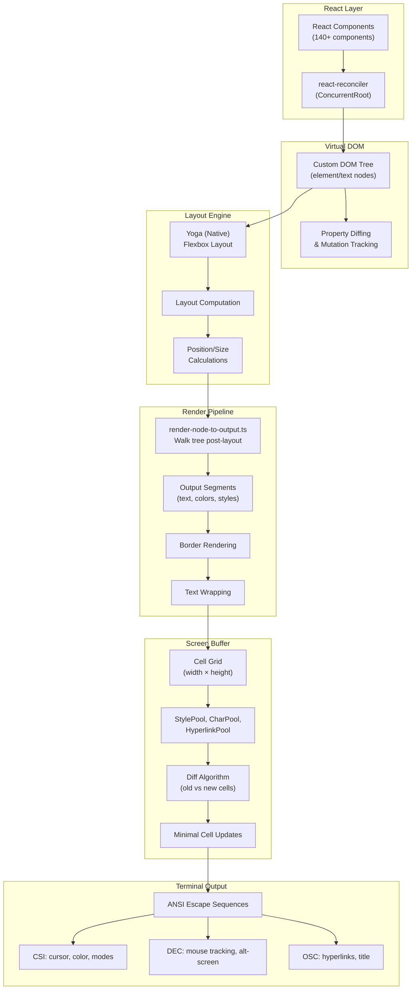
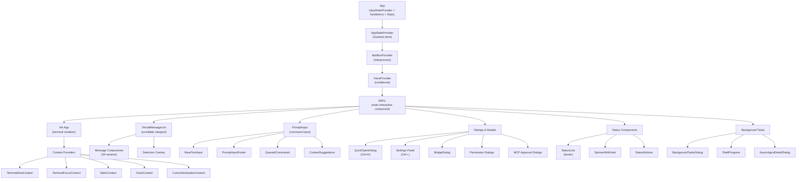
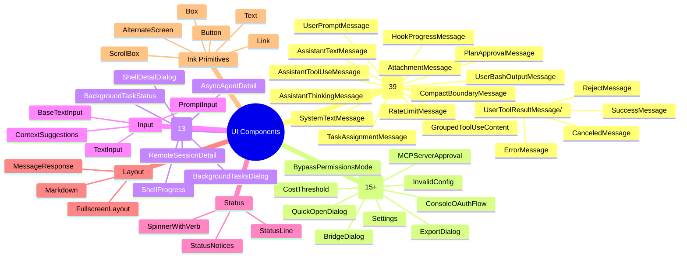
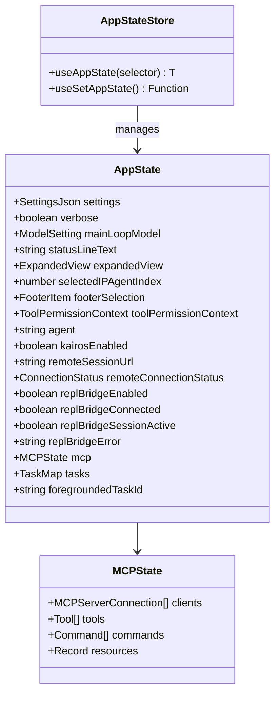
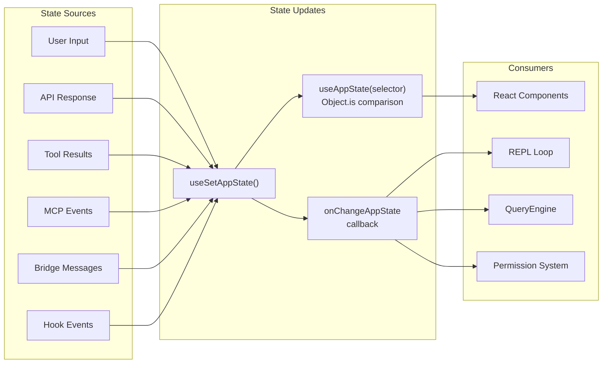
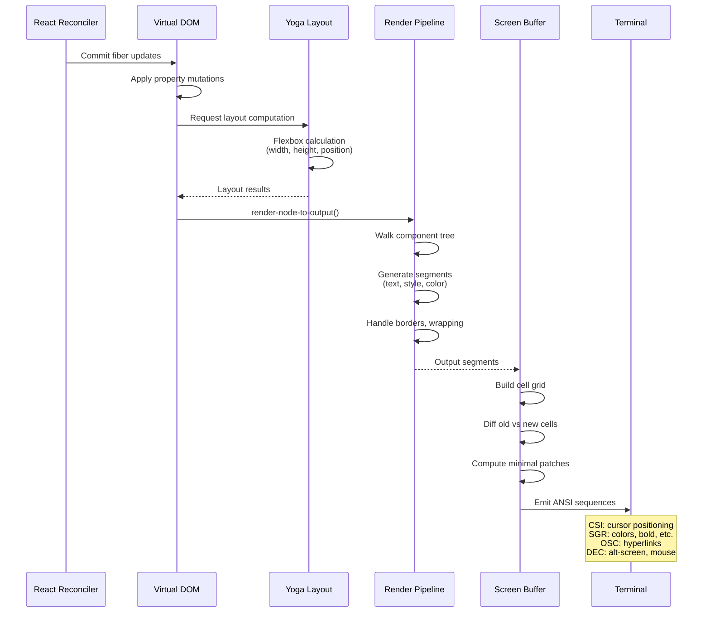
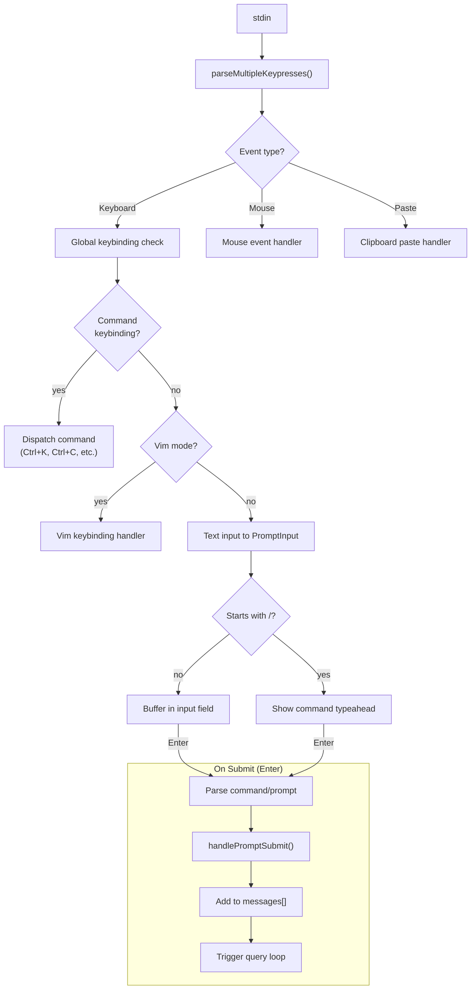
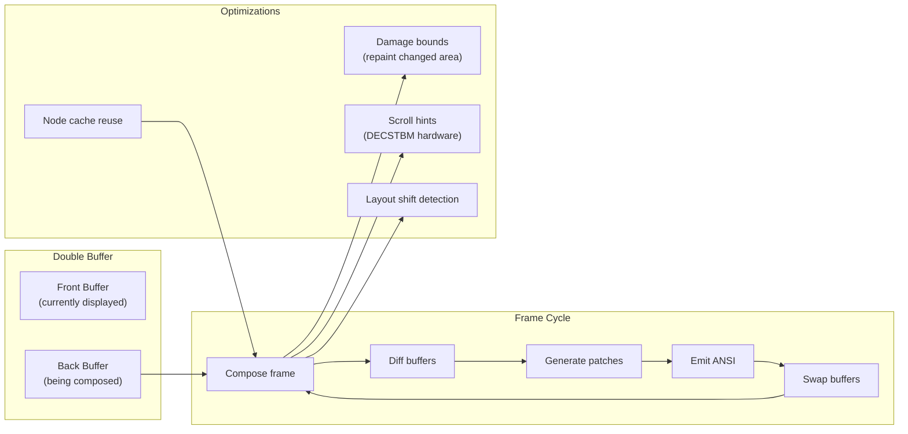
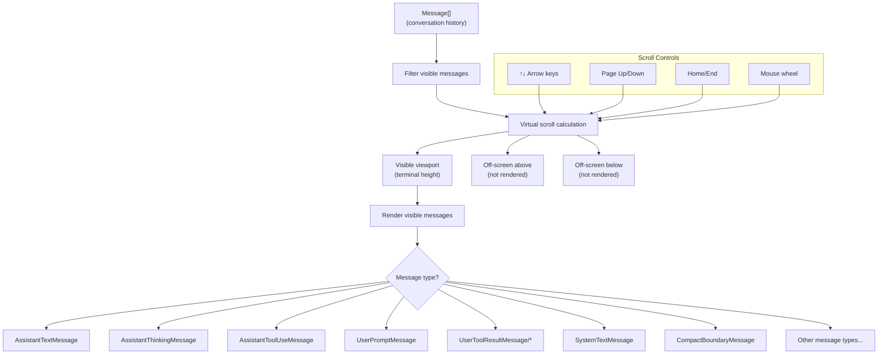
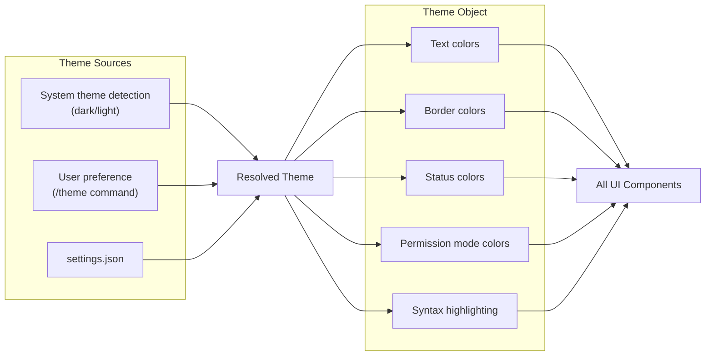

# UI Architecture

## Terminal Rendering Stack

Claude Code uses a custom fork of Ink (React for terminals) with Yoga for flexbox layout. The rendering pipeline converts a React component tree into optimized ANSI terminal output.

## Component Tree Structure

## Component Categories

## State Management (Zustand)

### State Flow

## Ink Rendering Pipeline

## Input Handling

## Frame Management

## Ink Components (Primitives)

| Component | Purpose |
|-----------|---------|
| `App.tsx` | Root with stdin/stdout context, Ctrl+C handler |
| `AlternateScreen.tsx` | Fullscreen mode (alt-screen buffer) |
| `Box.tsx` | Flex container (flexDirection, margin, padding) |
| `Text.tsx` | Styled text node (colors, bold, etc.) |
| `ScrollBox.tsx` | Scrolling viewport with keyboard navigation |
| `Button.tsx` | Clickable button (mouse support) |
| `Link.tsx` | Hyperlink (OSC 8 protocol) |
| `NoSelect.tsx` | Exclude region from text selection |
| `RawAnsi.tsx` | Pass-through ANSI sequences |
| `Spacer.tsx` | Flexible space |
| `Newline.tsx` | Line break |

## Virtual Message List

The message list uses virtual scrolling for performance with large conversations:

## Theme System

