# Bridge System, Coordinator, and Skills

## Bridge System (IDE Communication)

The bridge system (`src/bridge/`) enables bidirectional communication between the CLI and IDEs (VS Code, JetBrains) or the claude.ai web interface.

### Bridge Architecture

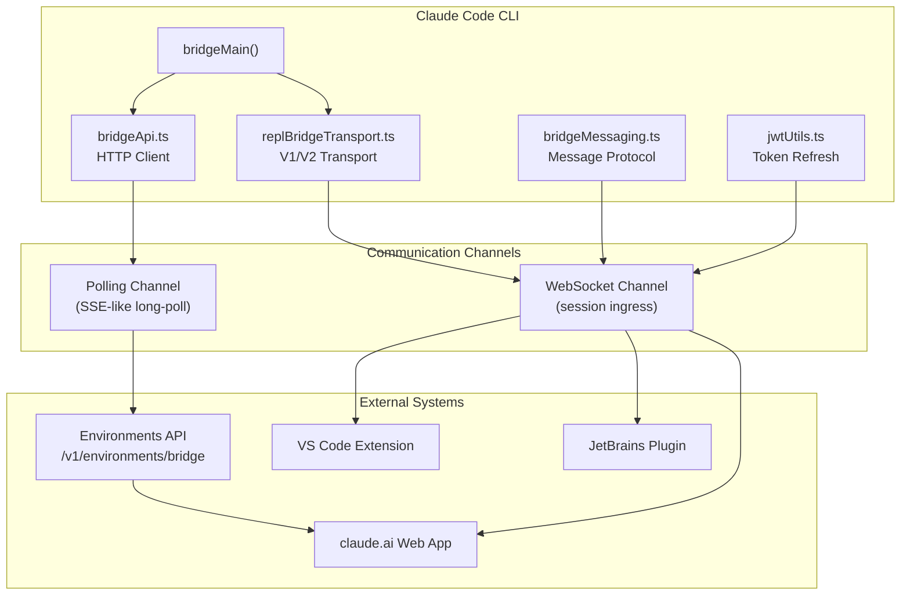

### Bridge Connection Flow

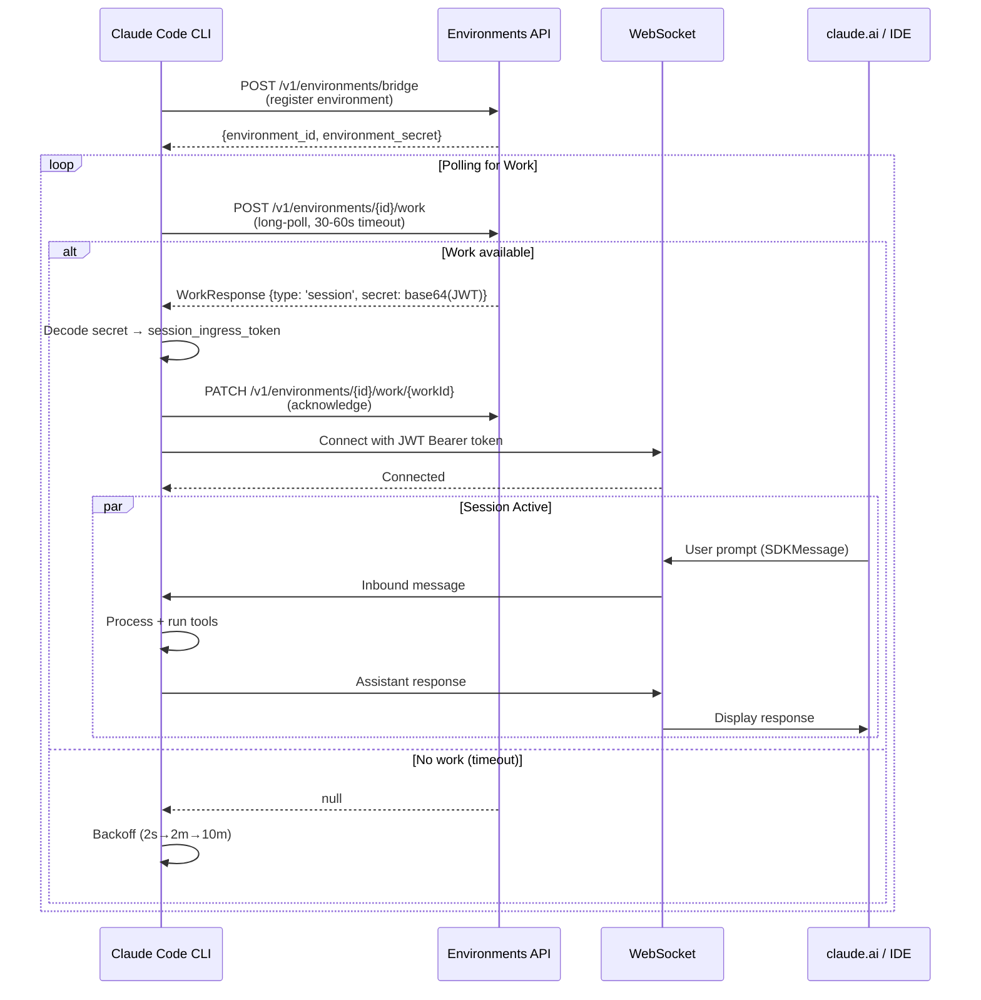

### Bridge Message Protocol

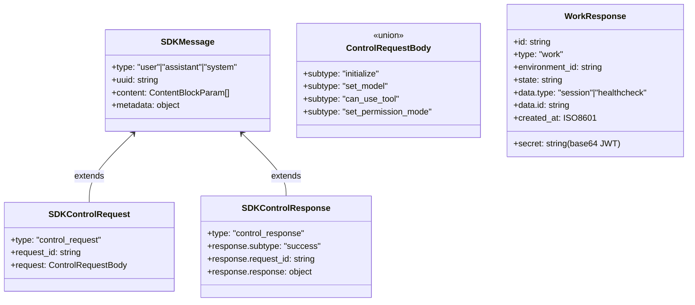

### JWT Token Refresh

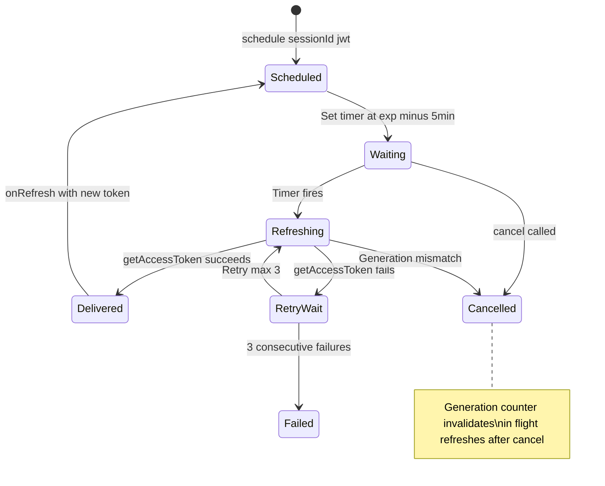

### Bridge Transport Versions

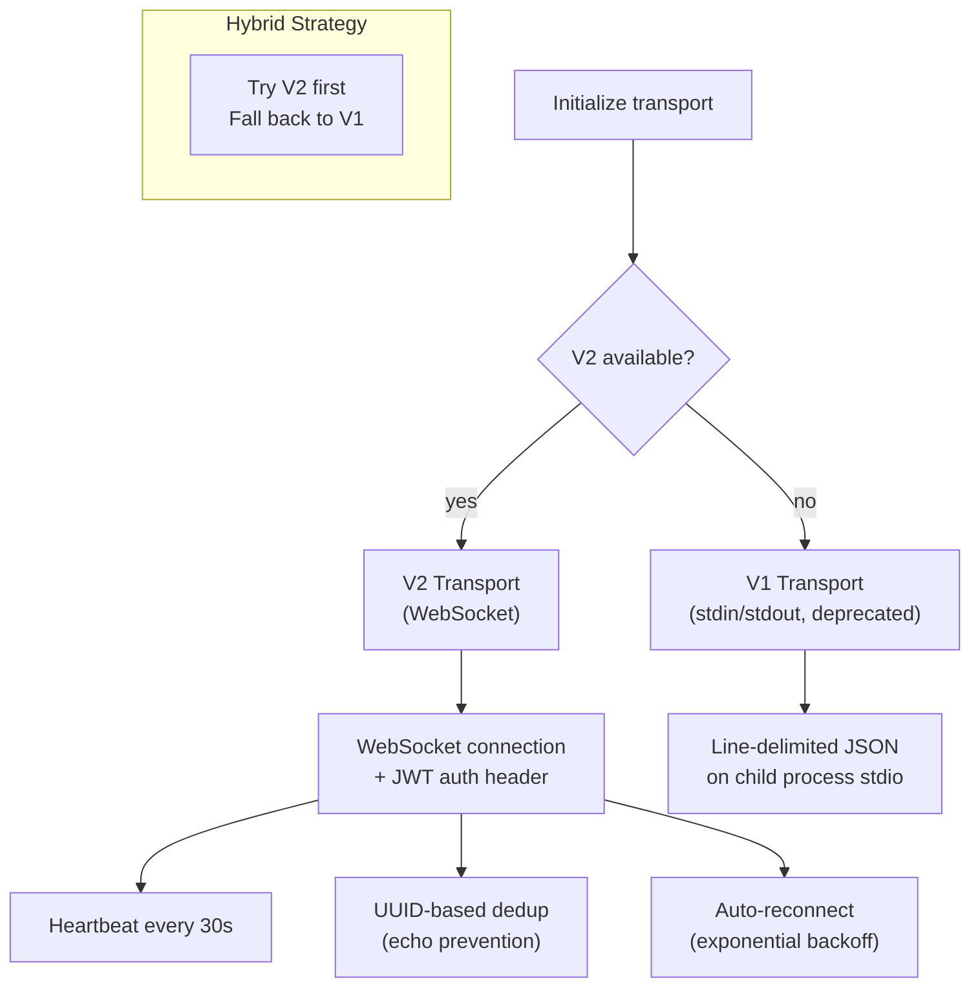

### Bridge Configuration

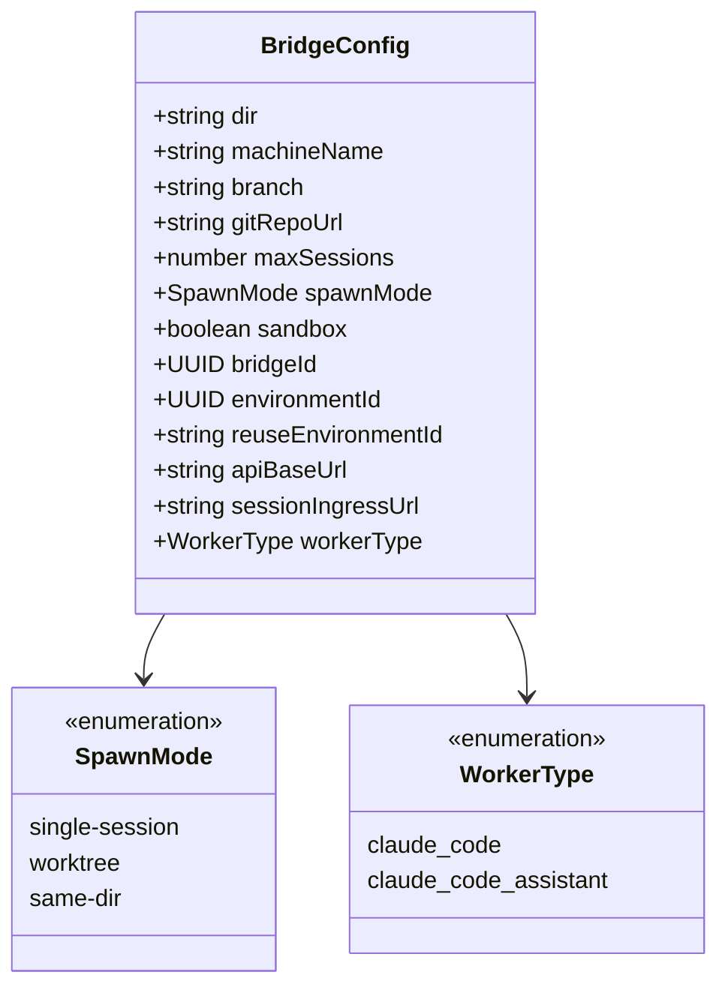

## Coordinator (Multi-Agent Orchestration)

The coordinator (`src/coordinator/`) enables multi-agent workflows where a coordinator agent dispatches work to specialized workers.

### Coordinator Architecture

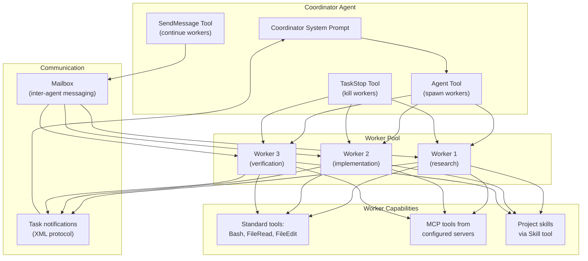

### Coordinator Flow

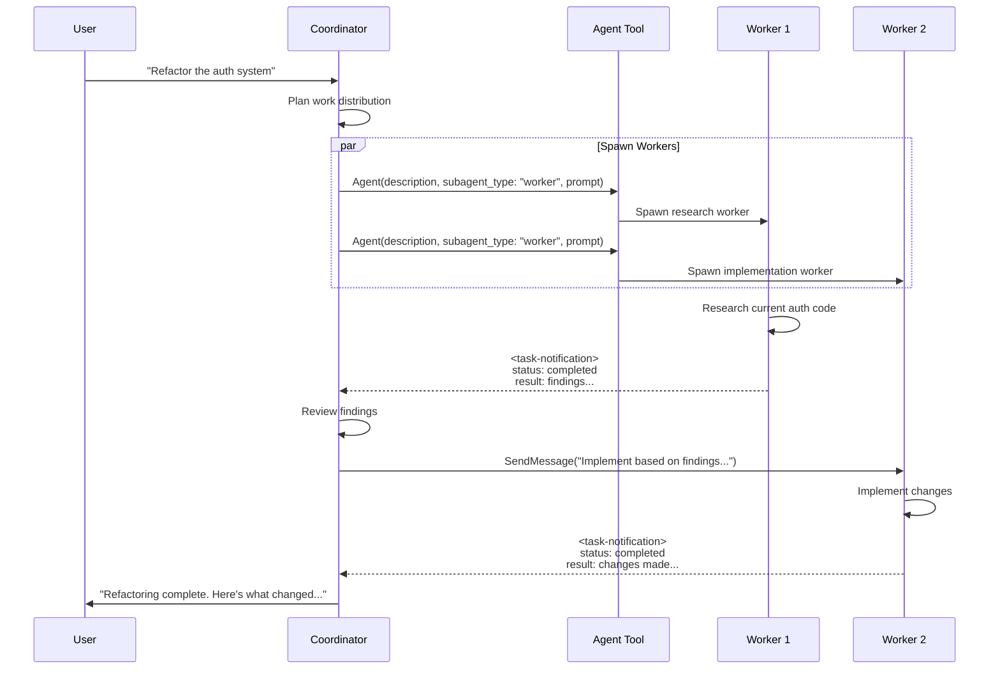

### Task Notification Protocol

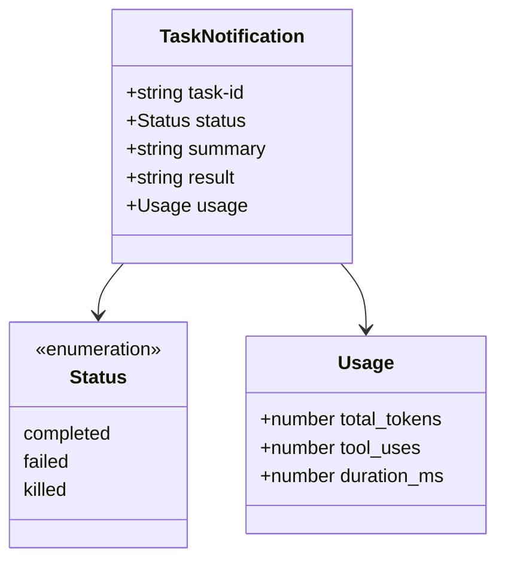

### Coordinator Mode Activation

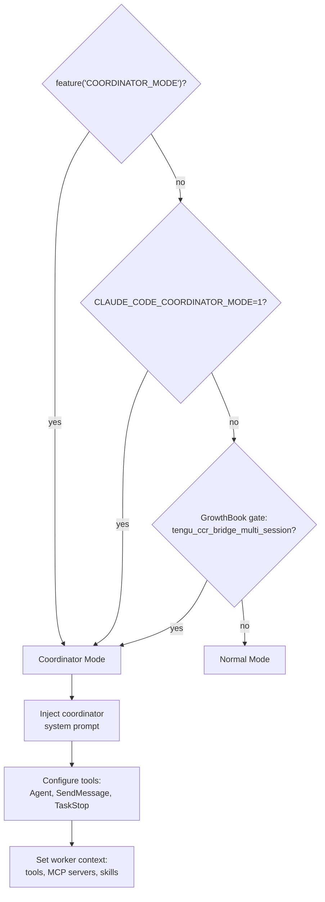

## Skills System

The skills system (`src/skills/`) provides reusable workflows that can be invoked as slash commands or by the model.

### Skills Architecture

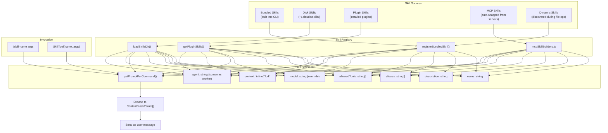

### Skill Loading Flow

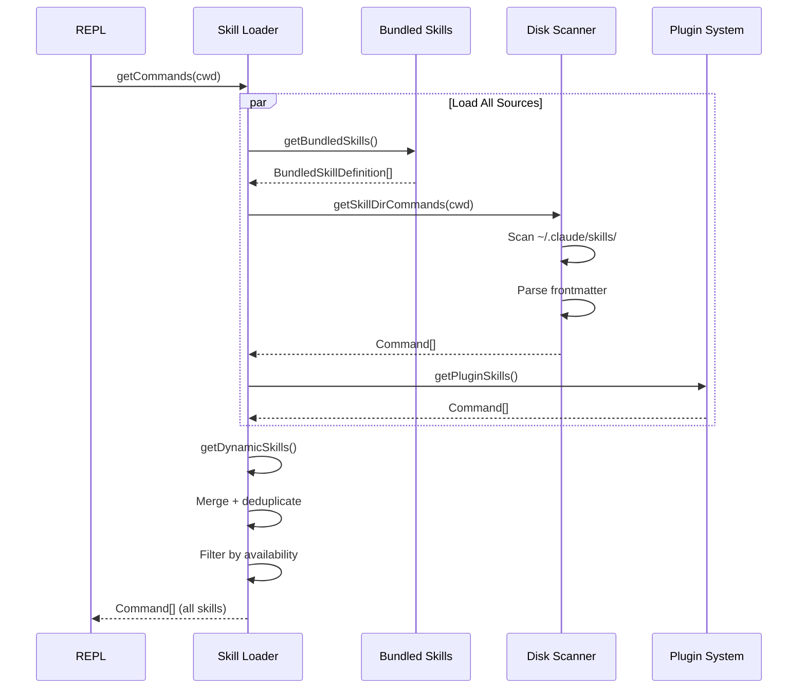

### Skill Execution

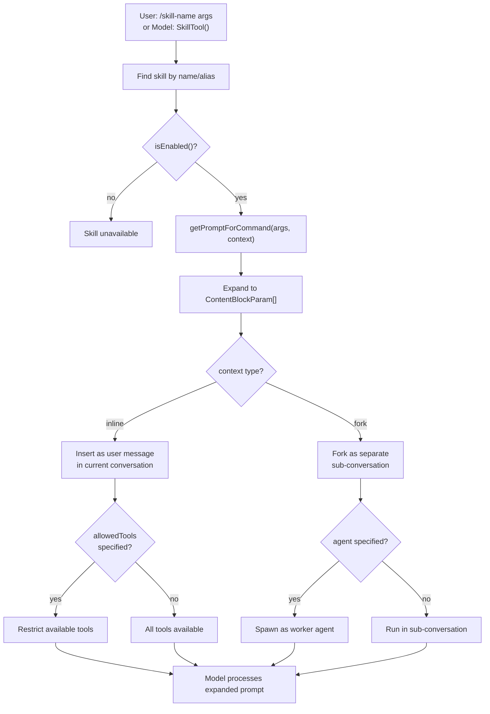

## Swarm System

For distributed agent work, the swarm system enables leader-worker collaboration:

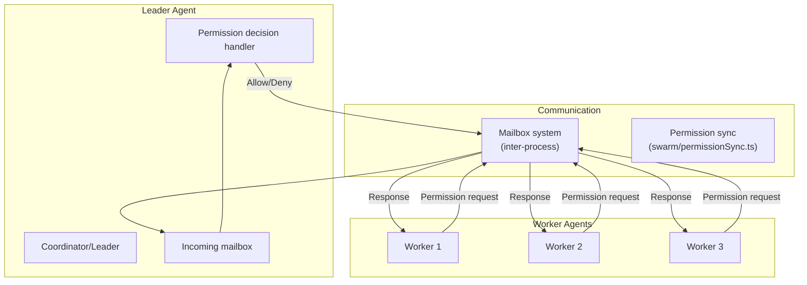

### Swarm Permission Flow

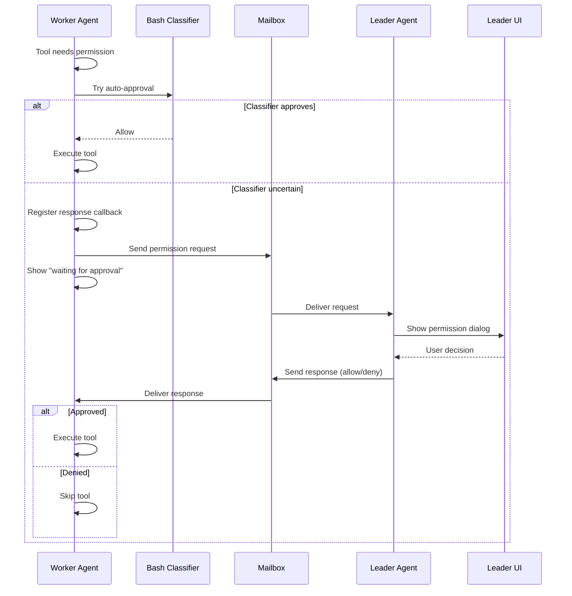
