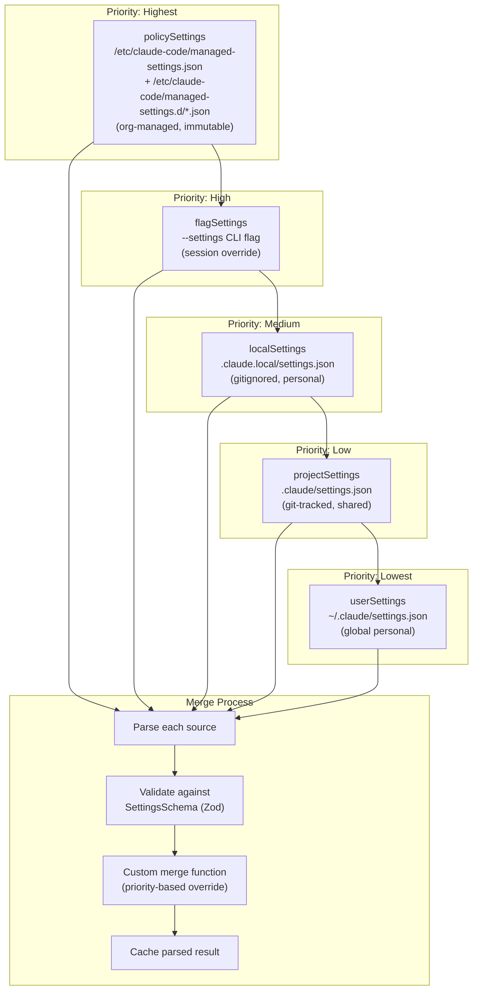
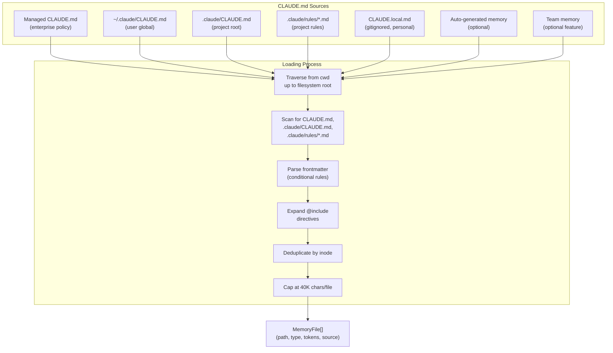
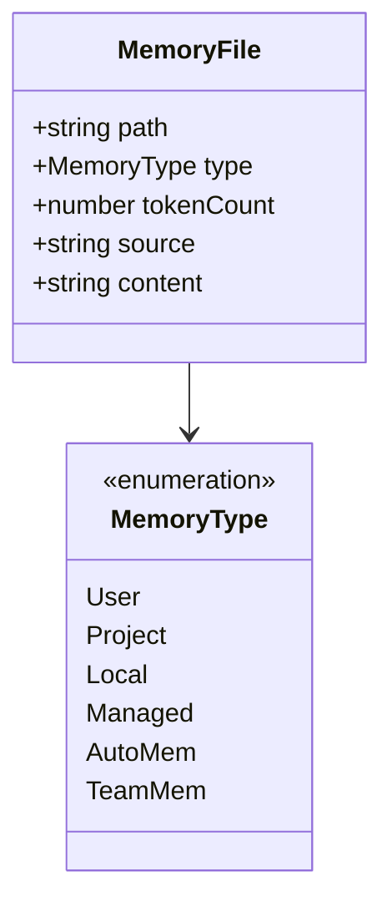
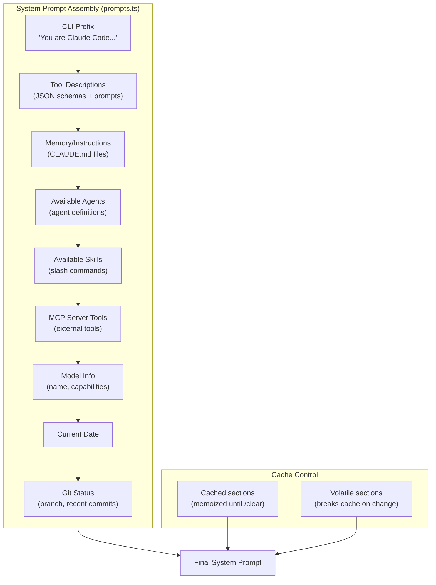
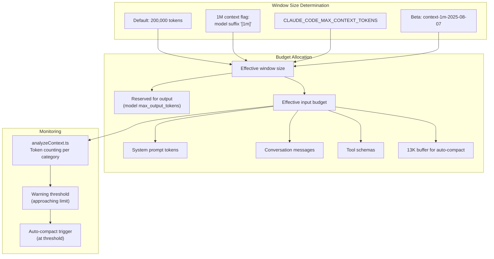
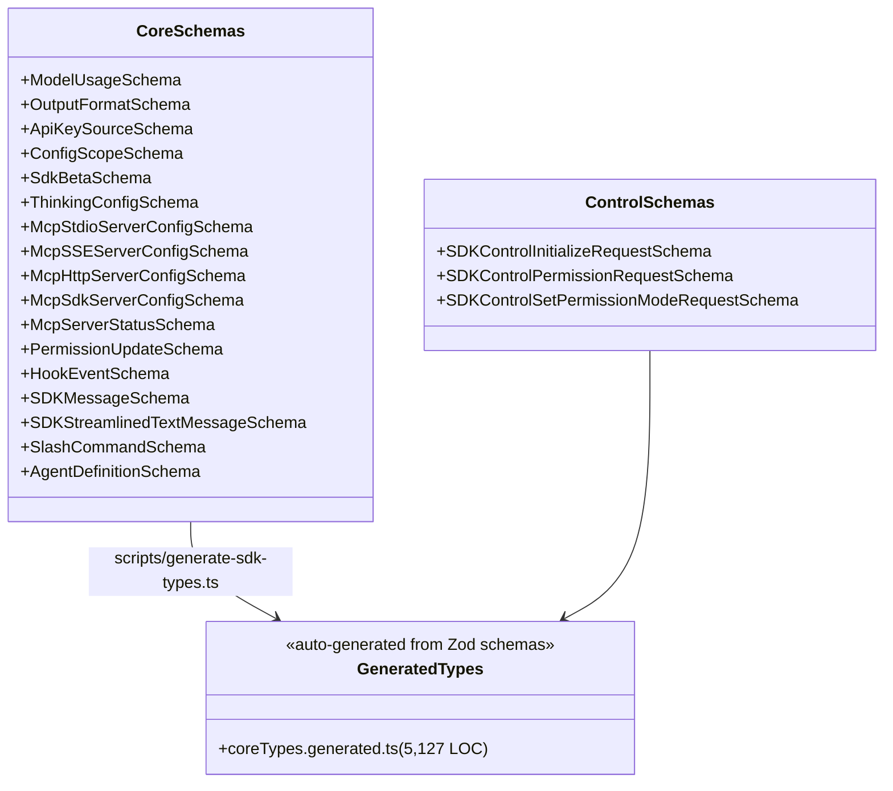
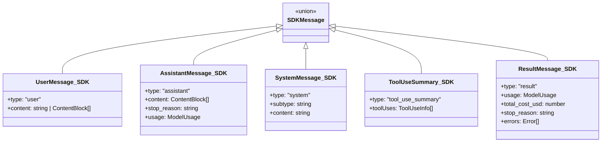
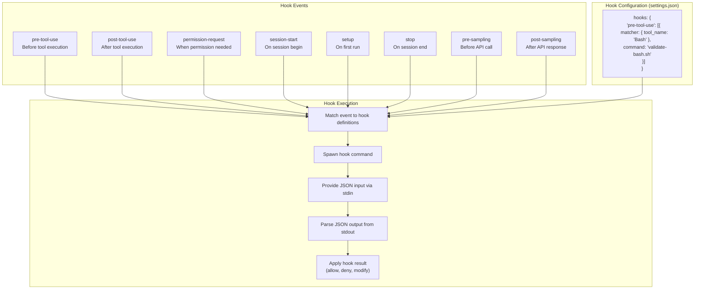
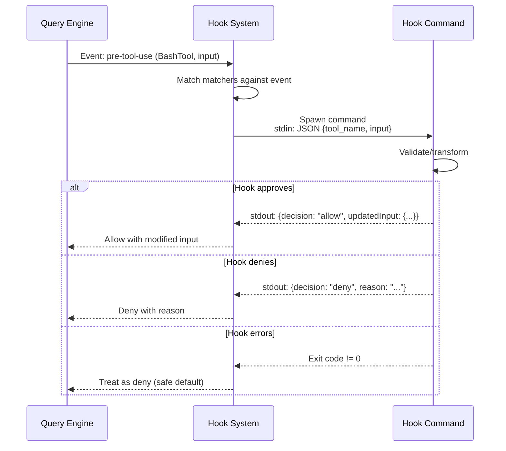
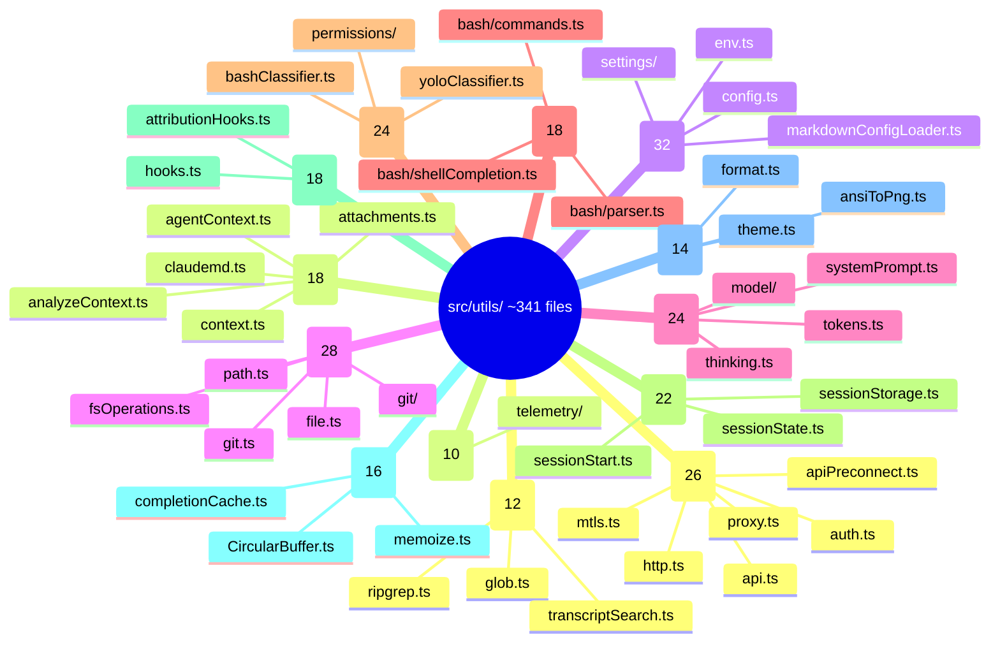

# Configuration and Context Assembly

## Settings Hierarchy

Claude Code loads configuration from 5+ sources with strict priority ordering:



## CLAUDE.md Loading System

Memory/instruction files are loaded from multiple scopes with `@include` directive support:



### Memory File Types



## System Prompt Assembly

The system prompt is built from multiple layers with a priority hierarchy:

```mermaid
flowchart TD
    subgraph "Prompt Priority"
        Override{"Override<br/>system prompt?"}
        Override -->|yes| UseOverride["Use override<br/>(loop mode)"]
        Override -->|no| CoordCheck{"Coordinator mode<br/>and no agent?"}
        CoordCheck -->|yes| UseCoord["Use coordinator prompt"]
        CoordCheck -->|no| AgentCheck{"Agent defined?"}
        AgentCheck -->|yes| ProactiveCheck{"Proactive mode?"}
        ProactiveCheck -->|yes| AppendAgent["Default + agent prompt"]
        ProactiveCheck -->|no| UseAgent["Agent prompt only"]
        AgentCheck -->|no| CustomCheck{"Custom prompt?"}
        CustomCheck -->|yes| UseCustom["Use custom prompt"]
        CustomCheck -->|no| UseDefault["Use default prompt"]
    end

    subgraph "Append"
        Append["+ appendSystemPrompt<br/>(always appended if specified)"]
    end

    UseOverride & UseCoord & AppendAgent & UseAgent & UseCustom & UseDefault --> Append
```

### Default System Prompt Components



## Context Window Management



## SDK Schemas (Zod v4)

The SDK types are defined as Zod schemas in `src/entrypoints/sdk/` and auto-generated to TypeScript:



### SDK Message Schema



## Hook System

Hooks allow external commands to run in response to Claude Code events:



### Hook Input/Output Flow



## Utility Module Categories


