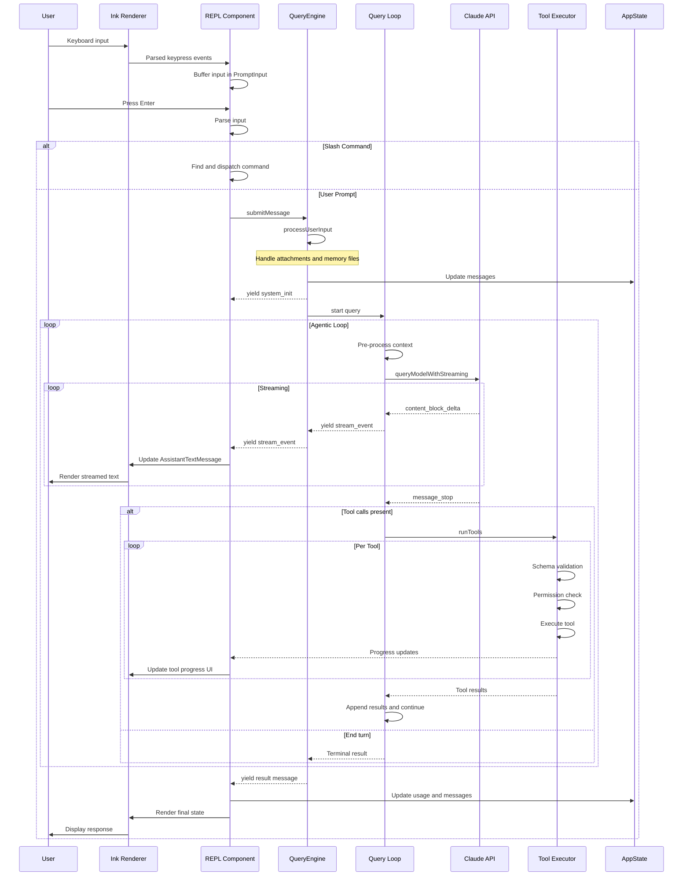
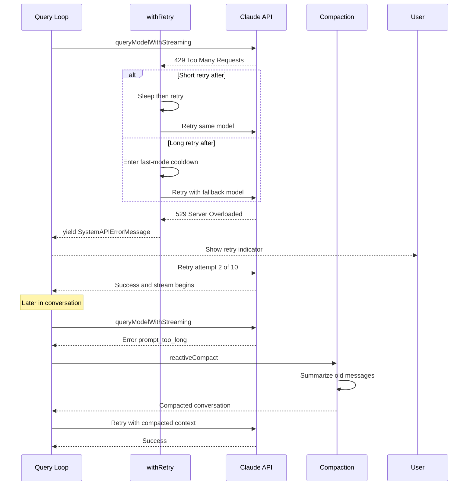
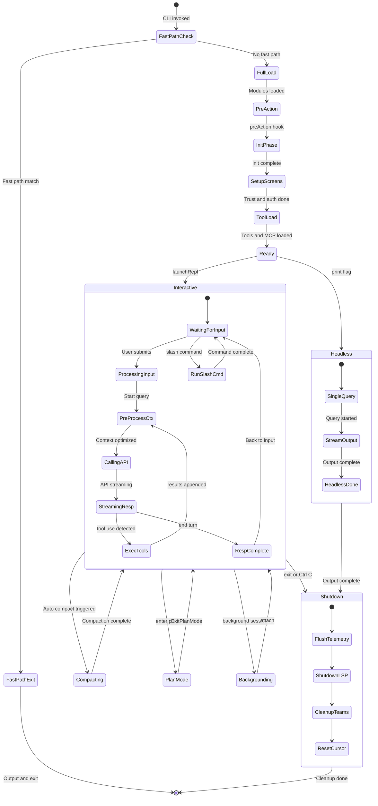
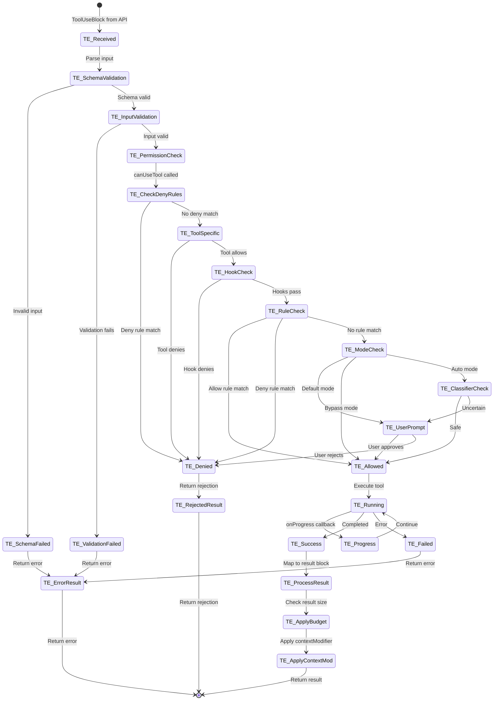
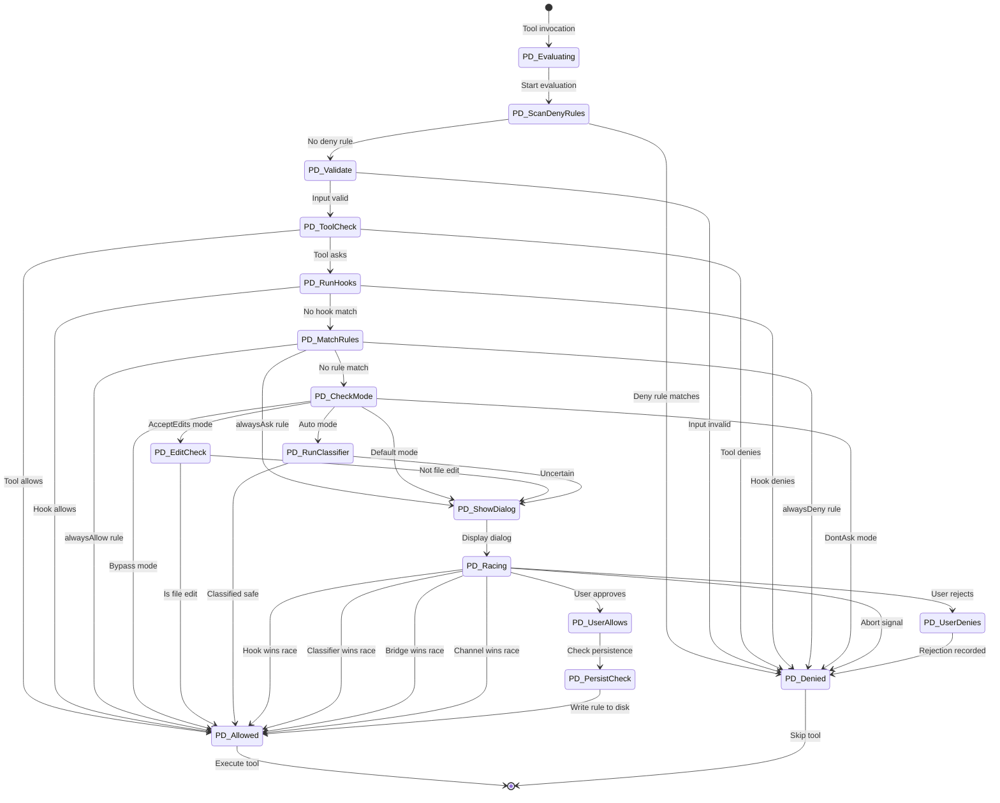
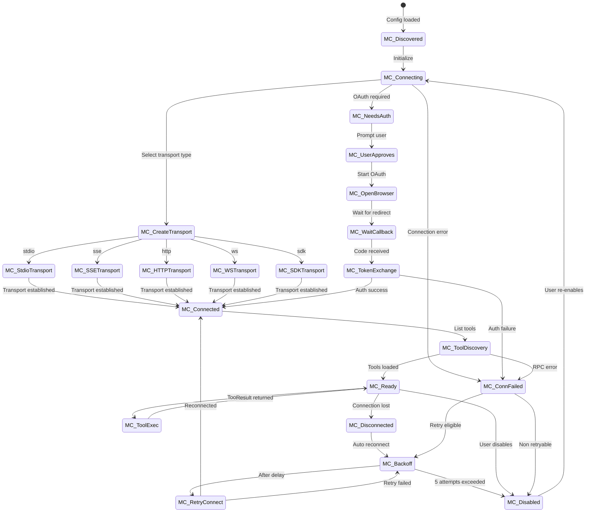
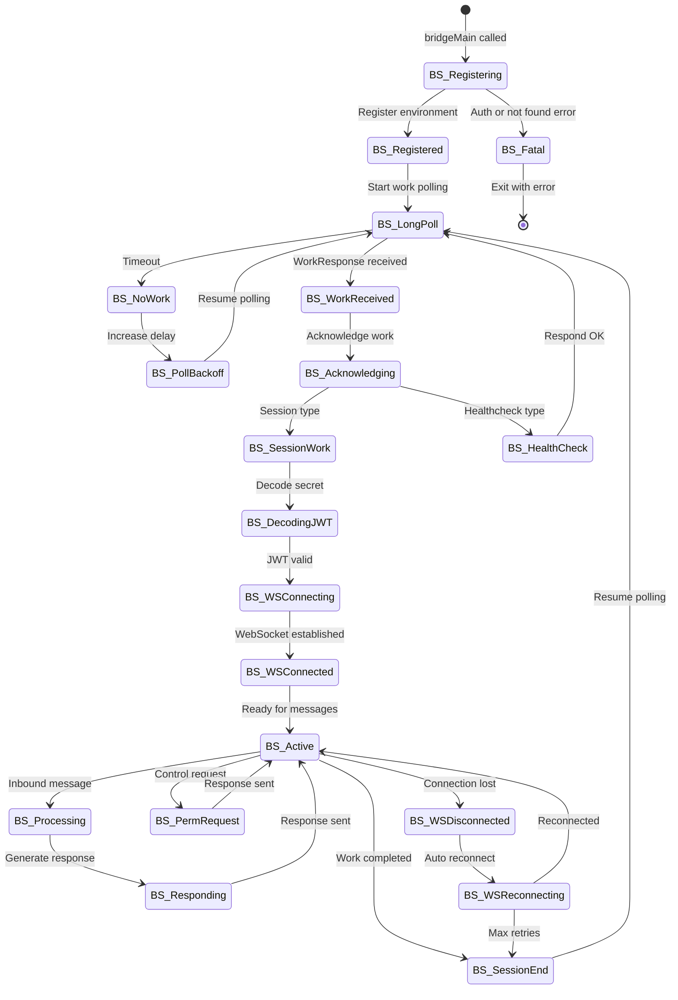
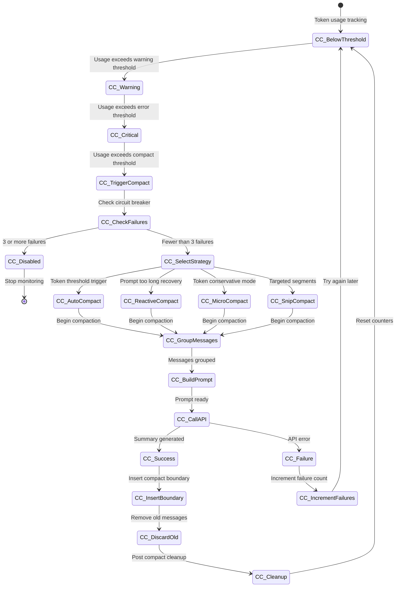
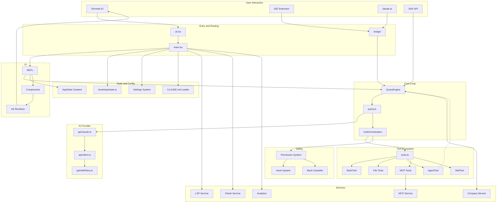

# Data Flow and State Machines

## End-to-End Data Flow

### Happy Path: User Prompt to Response

### Error Recovery Flow

## Session Lifecycle State Machine

## Tool Execution State Machine

## Permission Decision State Machine

## MCP Connection State Machine

## Bridge Session State Machine

## Context Compaction State Machine

## Complete Module Interaction Map

