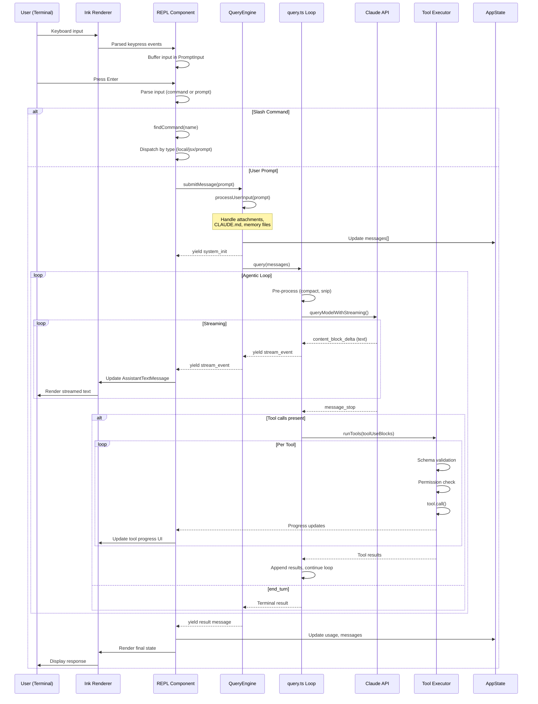
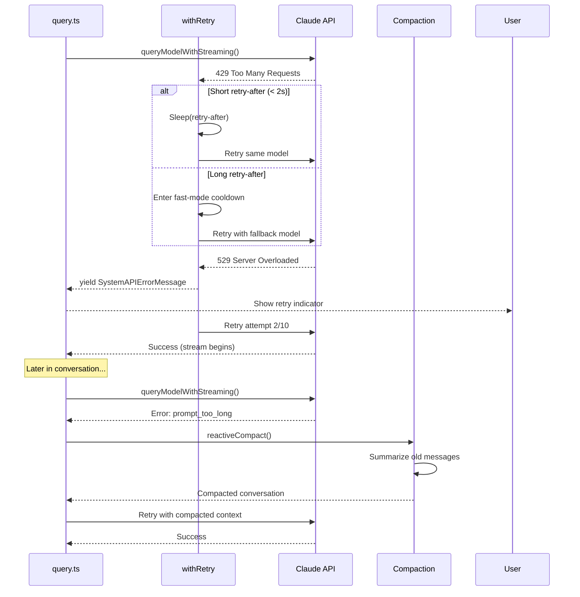
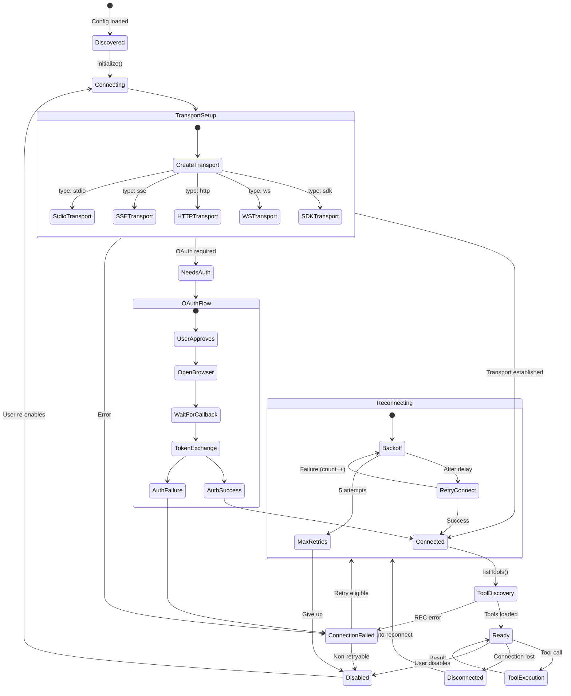
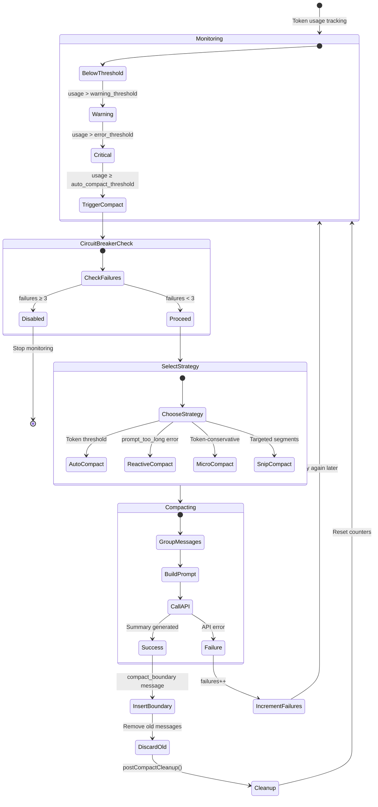
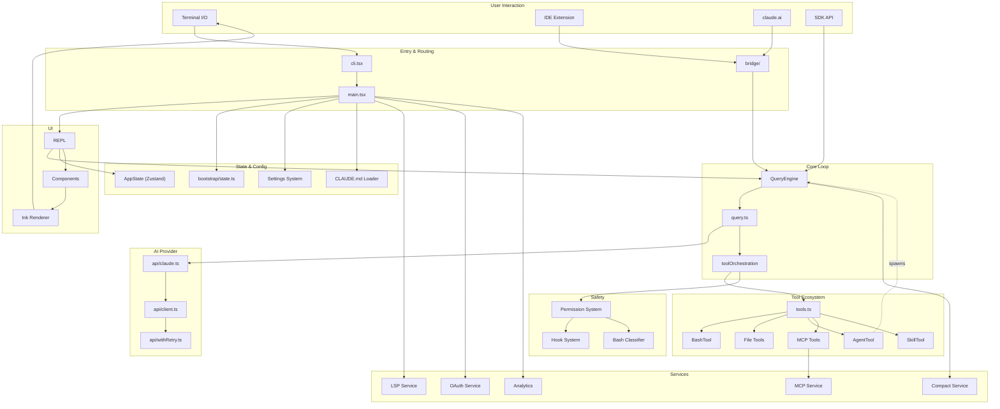

# Data Flow and State Machines

## End-to-End Data Flow

### Happy Path: User Prompt to Response



### Error Recovery Flow



## Session Lifecycle State Machine

```mermaid
stateDiagram-v2
    [*] --> Initializing : CLI invoked

    state Initializing {
        [*] --> FastPathCheck
        FastPathCheck --> FastPathExit : Fast-path match
        FastPathCheck --> FullLoad : No fast-path
        FullLoad --> PreAction : Modules loaded
        PreAction --> Init : preAction hook
        Init --> SetupScreens : init() complete
        SetupScreens --> ToolLoad : Trust + auth done
        ToolLoad --> Ready : Tools + MCP loaded
    }

    FastPathExit --> [*] : Output and exit

    Ready --> Interactive : launchRepl()
    Ready --> Headless : -p flag

    state Interactive {
        [*] --> WaitingForInput

        WaitingForInput --> ProcessingInput : User submits
        ProcessingInput --> QueryLoop : Start query

        state QueryLoop {
            [*] --> PreProcess
            PreProcess --> APICall
            APICall --> Streaming
            Streaming --> ToolExecution : tool_use
            Streaming --> ResponseComplete : end_turn
            ToolExecution --> PreProcess : results appended
        }

        ResponseComplete --> WaitingForInput
        WaitingForInput --> SlashCommand : /command
        SlashCommand --> WaitingForInput : Command complete
    end

    state Headless {
        [*] --> SingleQuery
        SingleQuery --> StreamOutput
        StreamOutput --> Complete
    }

    Interactive --> Compacting : Auto-compact triggered
    Compacting --> Interactive : Compaction complete

    Interactive --> PlanMode : /plan
    PlanMode --> Interactive : ExitPlanMode

    Interactive --> Backgrounding : --bg / Ctrl+Z
    Backgrounding --> Interactive : attach

    Interactive --> GracefulShutdown : exit / Ctrl+C+D
    Headless --> GracefulShutdown : Output complete
    Complete --> GracefulShutdown

    GracefulShutdown --> [*] : Cleanup done

    state GracefulShutdown {
        [*] --> FlushTelemetry
        FlushTelemetry --> ShutdownLSP
        ShutdownLSP --> CleanupTeams
        CleanupTeams --> ResetCursor
        ResetCursor --> [*]
    }
```

## Tool Execution State Machine

```mermaid
stateDiagram-v2
    [*] --> Received : ToolUseBlock from API

    Received --> SchemaValidation : Parse input

    SchemaValidation --> SchemaFailed : Invalid input
    SchemaValidation --> InputValidation : Schema valid

    SchemaFailed --> ErrorResult : Return error

    InputValidation --> ValidationFailed : validateInput() fails
    InputValidation --> PermissionCheck : Input valid

    ValidationFailed --> ErrorResult : Return error

    PermissionCheck --> Checking : canUseTool()

    state Checking {
        [*] --> DenyRules
        DenyRules --> ToolSpecific : No deny match
        DenyRules --> Denied : Deny rule match
        ToolSpecific --> HookCheck : Tool allows
        ToolSpecific --> Denied : Tool denies
        HookCheck --> RuleCheck : Hooks pass
        HookCheck --> Denied : Hook denies
        RuleCheck --> ModeCheck : No rule match
        RuleCheck --> Allowed : Allow rule match
        RuleCheck --> Denied : Deny rule match
        ModeCheck --> UserPrompt : Default mode
        ModeCheck --> Allowed : Bypass mode
        ModeCheck --> ClassifierCheck : Auto mode
        ClassifierCheck --> Allowed : Safe
        ClassifierCheck --> UserPrompt : Uncertain
        UserPrompt --> Allowed : User approves
        UserPrompt --> Denied : User rejects
    end

    Denied --> RejectedResult : Return rejection

    Allowed --> Executing : tool.call()

    state Executing {
        [*] --> Running
        Running --> Progress : onProgress callback
        Progress --> Running
        Running --> Success : Completed
        Running --> Failed : Error
    }

    Success --> ProcessResult : Map to ToolResultBlockParam
    Failed --> ErrorResult

    ProcessResult --> ApplyBudget : Check result size
    ApplyBudget --> ApplyContextMod : Apply contextModifier
    ApplyContextMod --> [*] : Return result

    ErrorResult --> [*] : Return error
    RejectedResult --> [*] : Return rejection
```

## Permission Decision State Machine

```mermaid
stateDiagram-v2
    [*] --> Evaluating : Tool invocation

    Evaluating --> DenyRuleCheck

    state DenyRuleCheck {
        [*] --> ScanRules
        ScanRules --> RuleMatched : Deny rule matches
        ScanRules --> NoMatch : No deny rule
    }

    RuleMatched --> Denied

    NoMatch --> InputValidation2

    state InputValidation2 {
        [*] --> Validate
        Validate --> Valid
        Validate --> Invalid
    }

    Invalid --> Denied

    Valid --> ToolPermissionCheck

    state ToolPermissionCheck {
        [*] --> ToolCheck
        ToolCheck --> ToolAllows : behavior: allow
        ToolCheck --> ToolDenies : behavior: deny
        ToolCheck --> ToolAsks : behavior: ask
    }

    ToolDenies --> Denied
    ToolAllows --> Allowed

    ToolAsks --> HookExecution

    state HookExecution {
        [*] --> RunHooks
        RunHooks --> HookResolves : Hook decides
        RunHooks --> HookPassthrough : No hook match
    }

    HookResolves --> Allowed : Hook allows
    HookResolves --> Denied : Hook denies

    HookPassthrough --> RuleMatching

    state RuleMatching {
        [*] --> MatchRules
        MatchRules --> AllowRule : alwaysAllow
        MatchRules --> DenyRule : alwaysDeny
        MatchRules --> AskRule : alwaysAsk
        MatchRules --> NoRule : No match
    }

    AllowRule --> Allowed
    DenyRule --> Denied
    AskRule --> InteractiveDecision

    NoRule --> ModeBasedDecision

    state ModeBasedDecision {
        [*] --> CheckMode
        CheckMode --> InteractiveDecision : default
        CheckMode --> Allowed : bypassPermissions
        CheckMode --> EditCheck : acceptEdits
        CheckMode --> Denied : dontAsk
        CheckMode --> ClassifierDecision : auto
    }

    EditCheck --> Allowed : Is file edit
    EditCheck --> InteractiveDecision : Not file edit

    state ClassifierDecision {
        [*] --> RunClassifier
        RunClassifier --> Allowed : Classified safe
        RunClassifier --> InteractiveDecision : Uncertain
    }

    state InteractiveDecision {
        [*] --> ShowDialog
        ShowDialog --> Racing

        state Racing {
            [*] --> WaitForFirst
            WaitForFirst --> HookWins : Hook resolves
            WaitForFirst --> ClassifierWins : Classifier resolves
            WaitForFirst --> BridgeWins : Bridge resolves
            WaitForFirst --> ChannelWins : Channel resolves
            WaitForFirst --> UserWins : User responds
            WaitForFirst --> AbortWins : Abort signal
        }

        HookWins --> Allowed
        ClassifierWins --> Allowed
        BridgeWins --> Allowed
        ChannelWins --> Allowed

        UserWins --> UserAllows : Allow (once/always)
        UserWins --> UserDenies : Reject

        AbortWins --> Denied
    end

    UserAllows --> PersistCheck
    PersistCheck --> Allowed : Allow always → write to disk
    PersistCheck --> Allowed : Allow once → session only

    UserDenies --> Denied

    Allowed --> [*] : Execute tool
    Denied --> [*] : Skip tool
```

## MCP Connection State Machine



## Bridge Session State Machine

```mermaid
stateDiagram-v2
    [*] --> Registering : bridgeMain() called

    Registering --> Registered : POST /environments/bridge
    Registering --> Fatal : 401/403/404

    Registered --> Polling : Start work polling

    state Polling {
        [*] --> LongPoll
        LongPoll --> WorkReceived : WorkResponse
        LongPoll --> NoWork : Timeout
        NoWork --> Backoff : Increase delay
        Backoff --> LongPoll : After delay
        note right of Backoff : 2s → 2m → 10m
    }

    WorkReceived --> Acknowledging : PATCH /work/{id}

    state "Session Type" as SType {
        Acknowledging --> SessionWork : type: session
        Acknowledging --> HealthCheck : type: healthcheck
    }

    HealthCheck --> Polling : Respond OK

    SessionWork --> DecodingJWT : Decode secret

    DecodingJWT --> WebSocketConnect : JWT valid

    state WebSocketConnect {
        [*] --> Connecting2
        Connecting2 --> Connected2 : WS established
        Connected2 --> Active : Ready for messages
    }

    state Active {
        [*] --> Idle
        Idle --> ProcessingMessage : Inbound message
        ProcessingMessage --> Responding : Generate response
        Responding --> Idle : Response sent

        Idle --> PermissionRequest : Control request
        PermissionRequest --> Idle : Response sent

        note right of Active : Heartbeat every 30s<br/>UUID dedup active
    }

    Active --> SessionEnd : Work completed
    Active --> Disconnected2 : Connection lost

    Disconnected2 --> Reconnecting2 : Auto-reconnect
    Reconnecting2 --> Active : Reconnected
    Reconnecting2 --> SessionEnd : Max retries

    SessionEnd --> Polling : Resume polling

    Fatal --> [*] : Exit with error
```

## Context Compaction State Machine



## Complete Module Interaction Map


